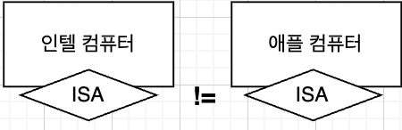
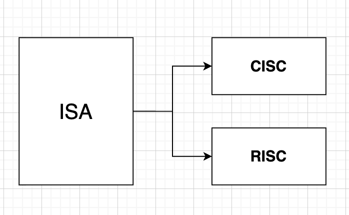
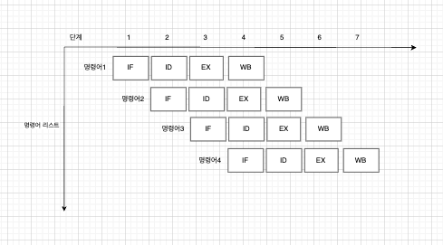

# CISC와 RISC

## ISA(Instruction Set Architecture)
* 컴퓨터의 하드웨어(HW)와 소프트웨어(SW) 사이의 인터페이스를 정의하는 명령어 집합 구조
* HW가 SW를 어떻게 이해할지에 대한 약속 (HW와 SW 사이의 인터페이스 역할)

 

### ISA의 동작

1. 어셈블러, 컴파일러는 정의된 명령어 집합을 통해 HW가 수행할 작업을 지시
2. CPU는 ISA에 정의된 명령어를 해석하고 실행하여 HW 레벨에서 작업을 수행

 

### ISA와 CPU의 관계

* **ISA가 다르다** → CPU가 이해할 수 있는 명령어가 다름
* **CPU가 이해할 수 있는 명령어가 다르다** → 어셈블리어가 다름

 

## CISC와 RISC

* CISC와 RISC는 ISA의 두 가지 주요 설계 방식

  

| **항목**           | **CISC**                              | **RISC**                              |
|--------------------|---------------------------------------|---------------------------------------|
| **명령어 집합**     | 복잡하고 다양한 명령어               | 단순하고 적은 수의 명령어             |
| **명령어 길이**     | 가변적                                | 고정된 길이                           |
| **명령어 실행 속도**| 여러 사이클에서 실행 가능            | 대부분의 명령어가 한 사이클 내에 실행 |
| **하드웨어 복잡도** | 복잡한 마이크로코드 및 하드웨어 설계 | 단순한 하드웨어 설계                  |
| **메모리 접근 방식**| 명령어 하나에서 메모리 직접 접근 가능| 로드/스토어 명령어로만 메모리 접근    |
| **파이프라이닝 효율**| 파이프라이닝 비효율적                | 파이프라이닝 효율적                   |
| **프로그램 크기**   | 짧고 간결한 프로그램                | 더 많은 명령어로 구성되어 길어질 수 있음 |
| **전력 소비**       | 상대적으로 더 높은 전력 소모         | 낮은 전력 소모                        |

 
 

##  CISC(Complex Instruction Set Computer)

* 복잡한 명령어들을 활용하는 CPU 설계 방식
* 하나의 명령어가 다수의 작업을 수행할 수 있는 설계 방식을 사용
* 다양하고 강력한 명령어의 집합을 사용하기 때문에 명령어의 크기와 형태가 다양함 (가변 길이 명령어)

**👍🏻 장점**
1. 고급 명령어의 지원
    * 다양하고 강력한 명령어를 지원하여, 적은 수의 명령어로도 프로그램을 실행할 수 있다.
2. 적은 코드
    * 고급 명령어를 사용함으로써, 짧은 코드로 복잡한 연산을 수행할 수 있으므로 프로그램의 크기가 작아진다.
    * 때문에 메모리의 공간을 절약할 수 있다.

**👎 단점**
1. 복잡한 HW
    * 복잡한 명령어를 처리하기 위해 HW를 설계할때 불가피하게 복잡하게 설계된다.

2. 일정하지 않은 명령어의 크기와 실행시간
    * 활용하는 명령어가 복잡하고 기능들이 다양하여 명령어의 크기와 실행 속도가 일정하지 않음
    * 때문에 명령어 하나를 실행하는데 여러 클럭 주기가 필요로 함.

3. 비효율적인 명령어 처리
    * 간단한 명령어를 처리하는데도 많은 싸이클을 소모할 수 있기 때문에 성능 부분에 약화될 수 있음.
    * 명령어 수행 시간이 길고 일정하지 않은 이유로 파이프 라인의 효율 또한 약화됨.

  
  

##  RISC(Reduced Instruction Set Computer)
* 명령어를 단순화 하고, 명령어 처리 속도를 빠르게 하기 위한 설계 기법
* 규격화된 명령어, 웬만하면 1싸이클 내외로 실행되는 명령어를 지향함 (고정 길이 명령어)
* 단순한 명령어 구조 때문에 여러 명령어를 겹쳐서 처리하는 파이프라인 실행에 용이함

**👍🏻 장점**

1. 간단한 HW
    * 간단한 명령어로 구성되어 복잡하지 않은 HW 설계가 가능하며, 전력 효율 또한 증가 됨.

2. 빠른 실행 속도
    *  또한 명령어가 간단하게 구성되어 있어, 명령어를 빠르게 실행할 수 있음.

3. 효율적인 파이프라인
    * 명령어의 구조가 규격화 되어 있고 짧기 때문에 파이프라인을 구축할때 효율적인 파이프라인이 됨

**👎 단점**
1. 많은 코드양
    * 복잡한 작업을 수행하기 위해선 여러개의 명령어가 조합되어야 하기 때문에, 코드양이 증가 될 수 있음.

2. 메모리 엑세스(접근)증가
    * 많은 연산을 위해 메모리에 접근할 일이 많아짐