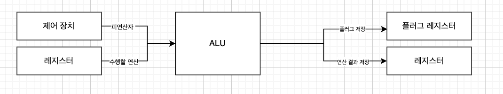

# ALU (Arithmetic Logic Unit)

CPU의 핵심 구성 요소 중 하나로, 데이터를 처리하고 연산을 수행하는 기능을 담당
* **산술 연산:**  덧셈, 뺄셈, 곱셈, 나눗셈 ..
* **논리 연산:** AND, OR, XOR, NOT ..

  

### ALU의 동작 과정

**1. 입력**

* 레지스터로 부터 2개 이상의 데이터(피연산자)를 입력 받음
* 제어 장치로부터 수행을 알려주는 연산의 제어 신호를 받음

**2. 연산 수행**

* 받아 드린 피연산자와 제어 신호를 통해 실제로 연산을 수행

**3. 출력**

* 연산 결과 값을 레지스터에 저장함
* 연산 결과에 대한 플러그를 플러그 레지스터에 저장

**여기서 플러그란?**
* 연산 결과에 대한 추가적인 상태정보를 말함

  

# 제어 장치 (Control Unit)

CPU의 또 다른 핵심 구성 요소로, 컴퓨터 시스템의 모든 동작을 제어하고 조정하는 역할을 담당
* **명령어 해독:** 메모리에서 가져온 명령어를 해독하여 실행할 작업을 결정
* **제어 신호 생성:** ALU, 레지스터, 메모리 등 다른 구성 요소에 제어 신호를 보내어 작업을 수행하도록 지시
* **명령어 실행 순서 제어:** 프로그램 카운터를 사용하여 명령어의 실행 순서를 제어

  

### 제어 장치의 동작 과정

**1. 명령어 인출 (Fetch)**
* 클럭의 신호를 받아드림
* 명령어 레지스터로 부터 해석할 명령어를 받아드림 (인출)

**2. 명령어 해독 (Decode)**

* 가져온 명령어를 해독하여 어떤 작업을 수행할지 결정
* 필요한 제어 신호를 생성

**3. 명령어 실행 (Execute)**

* 생성된 제어 신호를 ALU, 레지스터, 메모리 등으로 보내어 명령어를 실행
* 실행 결과를 레지스터나 메모리에 저장

**4. 결과 저장 (Store)**

* 실행 결과를 레지스터나 메모리에 저장
* 프로그램 카운터를 업데이트하여 다음 명령어로 이