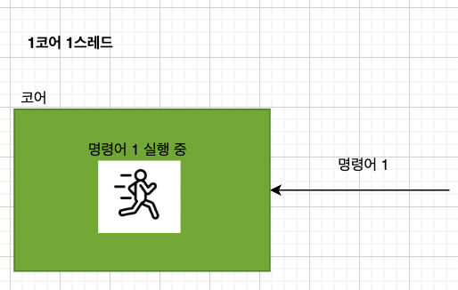
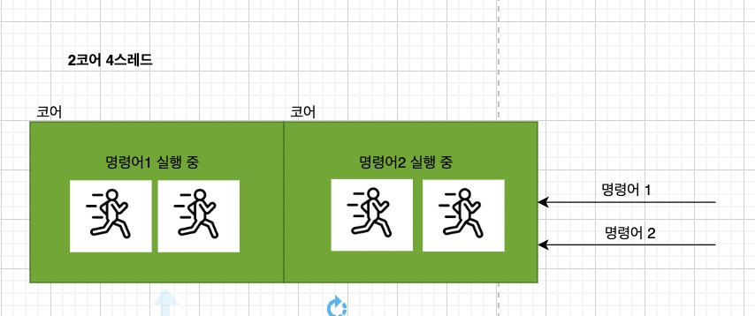
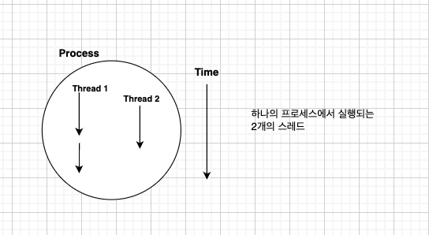

# CPU 기법

## CPU의 역할

* CPU는 컴퓨터의 핵심 부품으로, 연산과 제어를 담당함
    * 사람의 '뇌'에 비유할 수 있음
1. 명령어를 해석하고 실행 
2. 데이터를 처리하고 연산을 수행
3. 시스템의 자원(리소스)을 관리(제어)

<br/>

## 클럭
클럭은 CPU가 연산 작업을 처리하는 속도의 단위
* 컴퓨터는 이 클럭 신호에 따라 움직이게 됨
* 명령어 사이클이라는 정해진 흐름(프로세스)에 따라 명령어를 실행함
* 디지털 회로 상에서 심장박동에 비유됨

**단위 - Hz (헤르츠)**
* 1초에 몇 번 클럭이 나타나는지를 측정한 단위
    * (예) 1초에 1번 반복됨 = 1Hz
    * (예) 1초에 1GHz = 10억 번 반복됨

<br/>

## 코어
CPU 내부에 실리콘 웨이퍼라는 회워 위에 제작된 회로
명령어를 실행하는 여래개의 부품들의 집합
```
- 각 코어는 독립적으로 작업을 처리할 수 있음
- 코어가 많다고 무작정 CPU의 성능에는 영향을 주지 못함
- 코어마다 처리할 명령어를 적절하게 분배하는 것이 연산 속도에 영향을 주게 됨
```
**구성 요소**
```
ALU
제어 유닛
트랜지스터
레지스터
```

<br></br>

**멀티 코어/프로세스**

코어를 여러개 포함하고 있는 CPU를 멀티 코어/프로세스 라고 함


<br/>


## 스레드
실행 흐름의 단위

### 스레드의 종류

**1.하드웨어 스레드**
* 하나의 코어가 동시에 처리하는 명령어의 단위
* **멀티 스레드/CPU:** 하나의 코어로 여러 명령어를 처리하는 것 
    * **1코어 1스레드 인경우**

    * **2코어 4스레드인 경우**

<br><br/>


**2.소프트웨어 스레드**

어떠한 프로그램 내에서, 특히 프로세스 내에서 실행되는 흐름의 단위


<br></br>


## CPU와 OS가 프로그램을 실행하는 과정


1. 프로그램 로드 (Disk -> RAM)
    * 프로그램 실행 시, 디스크에서 RAM으로 이동 (인스턴스화) 
2. 프로세스 생성
    * RAM에 로드된 프로그램이 프로세스로 변환됨
    * 각 프로세스는 여러 개의 스레드를 가질 수 있음
    * 스레드 실행 (Context Switching)
3. 운영체제(OS)의 스케줄러가 실행할 스레드를 선택
    * CPU는 선택된 스레드를 실행
    * 실행이 끝나면 다음 스레드로 문맥 전환(Context Switch) 수행
    * CPU 실행 & 반복

4. 스레드가 실행되며 연산 수행
    * 필요하면 다른 스레드로 교체하며 실행 반복