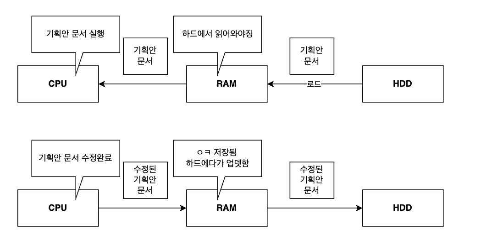

# 목차
* [개요](#ram)
* [1. 특징](#1-특징)
   * [1.1. 휘발성 메모리](#11-휘발성-메모리)
   * [1.2. 빠른 속도](#12-빠른-속도)
* [2. 상호작용 (CPU, 주.보조 기억 장치)](#2-상호작용-cpu-주보조-기억-장치)
* [3. 램 용량이 높으면 좋은 점](#3-램-용량이-높으면-좋은-점)
   * [3.1. 램의 크기가 작으면 겪는 불편함](#31-램의-크기가-작으면-겪는-불편함)
   * [3.2. 램의 크기가 넉넉하면 생기는 여유](#32-램의-크기가-넉넉하면-생기는-여유)
* [4. 종류](#4-종류)
   * [4.1. DRAM](#41-dram)
   * [4.2. SRAM](#42-sram)
   * [4.3. SDRAM (Synchronous Dynamic RAM)](#43-sdram-synchronous-dynamic-ram)
   * [4.4. DDR SDRAM (Double Data Rate SDRAM)](#44-ddr-sdram-double-data-rate-sdram)

  

# RAM
* 컴퓨터 시스템에서 데이터를 임시적으로 저장하고 빠르게 접근할 수 있게 하는 장치
* **주기억장치** 라고도 부름

  

## 1. 특징

### 1.1. 휘발성 메모리
컴퓨터의 전원이 꺼지면 RAM에 저장된 모든 명령어와 데이터가 사라짐.

### 1.2. 빠른 속도
* HDD보다 빠르게 데이터를 읽고 쓰기가 가능함
* CPU 쪽에서 데이터를 필요로 할때 RAM에 저장돤 데이터는 즉시 접근이 가능함.

-> 이런 이유로 OS나 실행 중인 프로그램에서 현재 작업 중인 데이터를 저장하는 공간으로 사용함. **(임시 저장소 역할)**

  

## 2. 상호작용 (CPU, 주.보조 기억 장치)

* `보조기억장치(HDD,SSD`는 비휘발성 메모리지만 CPU에 직접적으로 접근할 수 없음
* 프로그램이나 데이터를 처리할땐 보조기억 장치에 저장되어 있는 데이터를 <U>RAM에 로드함.</U>
* CPU 입장에선 RAM에 있는 데이터를 처리하게 됨

  

## 3. 램 용량이 높으면 좋은점 

### 3.1. 램의 크기가 작으면 겪는 불편함

* 워드, VSC, 카카오톡을 동시에 실행하여 처리하고 싶음
* 그런데 램이 워드 하나 처리할 용량을 가지고 있다면 나머지 작업을 하는데 불편함을 겪을 것임
* 이것은 컴퓨터 시스템 상에서 굉장히 큰 성능 저하를 겪게 함

### 3.2. 램의 크기가 넉넉하면 생기는 여유

* 램의 크기가 충분하면 보조기억장치(HDD)에서 많은 데이터를 가져와 저장할 수 있음
* 많은 프로그램이나 명령어를 동시에 실행하는데 유리해짐
* 램의 용량이 적었을때 보다 여러번 가져오는 수고를 덜 수 있음
* 이러한 이유 때문에 RAM 용량이 클 수록 많은 프로그램이나 명령어를 동시에 빠르게 처리할 수 있음.

  

## 4. 종류 

### 4.1. DRAM
* 저장된 데이터가 동적으로 변하는(사라지는) RAM
* 시간이 지나면 점차 저장된 메모리가 사라지기 때문에 일정 주기로 데이터를 재활성화(저장)해줘야 함
* 일반적으로 `메인 메모리`라고 하면 이 DRAM을 말함.

**사용하는 이유**
1. 소비 전력이 낮다.
2. 저렴하다.
3. 집적도가 높다. (빽뺵하게 더 만들 수 있다.)
4. 대용량으로 설계하기에 효과적이다.

### 4.2. SRAM
* 저장된 데이터가 변하지 않음.
* DRAM 보다 빠름
* 대용량까지 만들 필요는 없지만 속도가 빨라야 하는 저장장치임
* DRAM에 비해 덜 사용하고, `L1,L2.L3 처럼 CPU의 캐시 메모리`로 사용함

**사용하는 이유**
1. 소비 전력이 DRAM보다 크다
2. DRAM보다 비싸다.
3. DRAM보다 집적도가 낮다. 

### 4.3. SDRAM (Synchronous Dynamic RAM)
* **CPU의 클럭 신호와 동기화**되어 동작하는 발전된 형태의 DRAM.
* 클럭 신호의 타이밍에 맞춰 CPU와 데이터를 주고받아 효율적으로 동작.
* 기존 DRAM보다 더 빠르고 안정적인 데이터 전송이 가능.

**사용하는 이유**

1. CPU와 동기화
    * CPU의 클럭 신호와 동기화되어 데이터를 주고받기 때문에 효율적임.
2. 속도 향상
    * 기존 DRAM보다 빠른 데이터 전송 속도를 제공.
3. 안정성
    * 클럭 신호에 맞춰 동작하므로 데이터 전송의 안정성이 높음

### 4.4. DDR SDRAM (Double Data Rate SDRAM)
* SDRAM의 성능을 개선한 RAM으로, 현재 널리 사용되는 RAM 유형.
* **CPU의 클럭 주기의 상승/하강** 모두에서 데이터를 전송하여, 한 번의 클럭 주기에 두 배의 데이터를 처리 가능.
* DDR1, DDR2, DDR3, DDR4, DDR5 등 세대별로 발전
  - 세대가 올라갈수록 **속도는 빨라지고 전력 소비는 낮아짐**.
  - 최신 세대일수록 대역폭이 넓어지고 성능이 향상됨.

**사용하는 이유**
1. 높은 데이터 처리량
    * 클럭 주기의 상승/하강 모두에서 데이터를 전송하여, SDRAM보다 두 배의 데이터 처리 속도를 제공.
2. 효율성
    * 동일한 클럭 속도에서 더 많은 데이터를 처리할 수 있어 전력 소비가 줄어듦.
3. 세대별 발전
    * DDR1 → DDR5로 발전하면서 속도는 빨라지고 전력 소비는 낮아져 최신 시스템에 적합.
4. 범용성
    * 현재 대부분의 컴퓨터와 서버에서 표준 메모리로 사용됨.