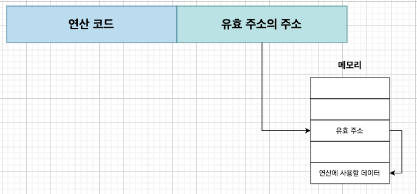

# 명령어 주소 지정 방식

## 주소 지정 방식

* 피연산자(Operand)에 명령어의 주소나 레지스터의 주소를 명시하는 방식
* 주소를 사용함으로써 메모리 공간을 절약하며, 재사용할 수 있음
* 주소 지정 방식은 크게 2가지로 나누어짐
    1. 메모리 주소 지정
    2. 레지스터 주소 지정

**메모리 주소 지정**

오퍼랜드 필드 안에 메모리 주소를 명시하면 2^6 -> 2^16으로 증가하게 됨

**레지스터 주소 지정**

오퍼랜드 필드 안에 레지스터 주소를 명시하면, 2^6 -> 레지스터가 저장할 수 있는 공간만큼 증가함

  

## 1. 즉시 주소 방식

연산에 사용할 데이터를 오퍼랜드에 직접 명시하는 방식
* 표시할 수 있는 데이터의 크기가 작아짐
* 연산에 사용할 데이터를 레지스터나 메모리에서 찾는 과정을 생략하고 직접 접근하기에 다른 방식보다 빠름

  

## 2. 직접 주소 방식

오퍼랜드에 유효 주소를 직접 명시하는 방식
* 표시할 수 있는 데이터의 크기 증가
* 오퍼랜드 필드의 크기가 짧아져, 유효 주소를 표현하는 데 제한이 있을 수 있음

  

## 3. 간접 주소 방식

오퍼랜드에 유효 주소의 주소를 간접적으로 명시하는 방식
* 유효 주소를 표현할 수 있는 범위의 크기 증가
* 메모리에 대한 접근을 2번 해야 하기 때문에 일반적으로 느린 편임

  

## 4. 레지스터 주소 방식

오퍼랜드에 연산에 사용할 데이터를 저장한 유효 주소를 직접적으로 명시하는 방식
* CPU 내부에 있는 메모리에 접근하는 방식보다 CPU 내부에 레지스터에 접근하는 방식이 일반적으로 더 빠름
* 레지스터의 크기에 따라 표현할 수 있는 범위에 제약을 받게 됨

  

## 5. 레지스터 간접 주소 지정 방식

오퍼랜드에 연산에 사용할 데이터를 메모리에 저장하고 해당 유효 주소를 저장한 레지스터를 명시하는 방식
* 유효 주소를 저장한 레지스터를 통해 메모리에 접근
* 메모리 접근이 필요하기 때문에 레지스터 주소 방식보다 느림