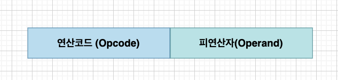
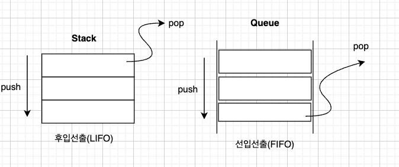

# 명령어의 구조


명령어의 구조는 크게 두가지로 나누어짐

<br></br>


## 1. 연산 코드 (Opcode)
* 명령어가 수행할 작업의 종류를 지정
* 연산코드가 담고 있는 내용은 CPU마다 다름
<br></br>

### 1.1. 주요 연산 코드

**데이터 전송**
| 명령어  | 설명                             |
|---------|----------------------------------|
| MOVE    | 데이터 이동                      |
| STORE   | 메모리에 저장                    |
| LOAD    | 메모리 -> CPU                    |
| PUSH    | 스택에 데이터 저장               |
| POP     | 스택에서 최상단에 있는 데이터를 추출 |




**산술/논리 연산**
| 명령어    | 설명                             |
|-----------|----------------------------------|
| ADD       | 덧셈 수행                        |
| SUBTRACT  | 뺄셈 수행                        |
| MULTIPLY  | 곱셈 수행                        |
| DIVIDE    | 나눗셈 수행                      |
| INCREMENT | 피연산자(Operand)에 1을 더함     |
| DECREMENT | 피연산자(Operand)에서 1을 뺌     |
| AND       | AND 연산 수행                    |
| OR        | OR 연산 수행                     |
| NOT       | NOT 연산 수행                    |
| COMPARE   | 두 개의 숫자 또는 TRUE/FALSE 값을 비교 |


**제어흐름 변경**
| 명령어          | 설명                                               |
|-----------------|----------------------------------------------------|
| JUMP            | 특정 주소로 실행 순서 변경                         |
| CONDITIONAL JUMP| 조건에 부합할 때 특정 주소로 실행 순서 변경        |
| HALT            | 프로그램의 실행을 멈춤                             |
| CALL            | 되돌아올 주소를 저장한 채 특정 주소로 실행 순서 변경 |
| RETURN          | CALL을 호출할 때 저장했던 주소로 돌아감            |


**입출력 제어**
| 명령어    | 설명                             |
|-----------|----------------------------------|
| READ(INPUT)  | 특정 입출력 장치로부터 데이터 읽기 |
| WRITE(OUTPUT)| 특정 입출력 장치로 데이터 작성   |
| START IO     | 입출력 장치 시작                |
| TEST IO      | 입출력 장치의 상태 확인          |


<br></br>


## 2. 피연산자(Operand)
명령어가 수행할 때 **연산에 사용하는 데이터, 데이터가 저장된 위치(주소)**를 저장하는 부분.  
`Operand`가 담기는 공간에는 연산에 사용되는 데이터가 저장된 값이 더 자주 담김. (**주소 필드**)

**📌 Ex**
```assembly
mov eax, 0   ; 오퍼랜드가 2개인 경우
pop rbp      ; 오퍼랜드가 1개인 경우
rer          ; 오퍼랜드가 없는 경우
