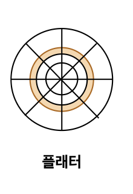
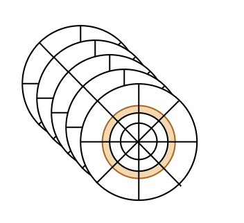
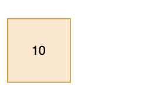

1. [하드 디스크 (HDD)](#1-하드-디스크-hdd)
    - [1.1. 구조](#11-하드-디스크의-구조)
        - [1.1.1. 플래터](#111-플래터)
        - [1.1.2. 실린더](#112-실린더)
        - [1.1.3. 플래터 헤드](#113-플래터-헤드)
        - [1.1.4. 스핀들 모터](#114-스핀들-모터)
        - [1.1.5. 디스크 암](#115-디스크-암)
    - [1.2. 성능 요소](#12-하드-디스크의-성능)
        - [1.2.1. 탐색 시간 (Seek Time)](#121-탐색-시간-seek-time)
        - [1.2.2. 회전 지연 (Rotational Latency)](#122-회전-지연-rotational-latency)
        - [1.2.3. 전송 시간 (Data Transfer Time)](#123-전송-시간-data-transfer-time)

2. [플래시 메모리 (Flash Memory)](#2-플래시-메모리-flash-memory)
    - [2.1. 종류](#21-플래시-메모리의-종류)
        - [2.1.1. NAND 플래시](#211-nand-플래시)
            - [2.1.1.1 NAND 플래시의 세부 분류](#2111-nand-플래시의-세부-분류)
        - [2.1.2. NOR 플래시](#212-nor-플래시)
    - [2.2. 저장 단위](#22-플래시-메모리의-단위)
    - [2.3. Page의 상태](#23-page의-상태)
   

# 1. 하드 디스크 (HDD)
* `비휘발성`, `순차 접근`이 가능한 컴퓨터의 보조 기억장치
* 원래는 <U>자기 디스크(magnetic disk drive, MDD)</U>였는데, 자기 자석의 성질로 데이터를 저장함

  

## 1.1. 하드 디스크의 구조

  

### 1.1.1. 플래터

* 원판 모양으로 구성 되어있음
* 실질적으로 하드디스크에 데이터가 저장되어있는 곳
* N극과 S극을 저장하고, N극과 S극은 각각 0과 1의 역할을 함
* `트랙`과 `섹터`라는 단위로 데이터를 저장함
    * 트랙
        - 하드 디스크의 플래터 표면에 그려진 동심원 모양의 원형 경로
        - 트랙에는 번호라는 것이 존재하는데, 하드 디스크의 중심으로 부터 0번부터 바깥쪽 까지 번호가 할당됨

    * 섹터
        - 트랙을 더 세밀하게 나눈 단위로, 데이터를 저장하는 최소한의 단위
        - 하나의 섹터는 512byte or 4096byte를 저장할 수 있음
        - 각 세터마다 일정한 크기의 데이터가 저장됨

  

### 1.1.2. 실린더

* `트랙`이 위치한 한 곳을 모아 연결한 논리적 단위
* 여러겹의 플래터가 사용될 수 있음

  

### 1.1.3. 플래터 헤드

* 플래터를 대상으로 데이터를 읽고 사용하는 요소

**?? : 연속된 정보를 하나의 실린더에 기록하는 이유:**
디스크 암을 움직이지 않고도 바로 데이터에 접근할 수 있기 때문

  

### 1.1.4. 스핀들 모터
* 플래터를 회전 시키는 역할을 수행
* 회전수를 나태내는 `RPM이라는 단위`로 표현함
    * RPM 20000 = 1분에 20000바퀴를 회전

  

### 1.1.5. 디스크 암
* 헤드를 원하는 위치로 이동시키는 요소

  
  

## 1.2. 하드 디스크의 성능 

  

### 1.2.1. 탐색 시간 (Seek time) 
.png)
* `읽기/쓰기 헤드`가 원하는 데이터가 저장된 트랙까지 이동된 시간을 의미함.
* Seeking이라고도 하며, 하드디스크의 작업중 가장 시간이 많이 잡아먹기로 유명함.

  

### 1.2.2. 회전 지연 (Rotational Latency)
.png>)
* 디스크가 회전하여 `읽기/쓰기 헤드`가 원하는 섹터에 도달되기 까지의 걸리는 시간을 의미함
    * 디스크가 빠르게 회전할 수록 회전 지연시간이 단축됨

  

### 1.2.3. 전송 시간 (Data Transfer Time)
.png>)
* `읽기/쓰기 헤드`가 원하는 데이터에 접든 되었을 경우 실제로 데이터를 전송하는데 걸리는 시간을 의미.

  

  

  

# 2. 플래시 메모리 (Flash Memory)
* 데이터를 전기적으로 기록하는 반도체 기반 저장장치
* `셀(cell)`이라는 단위로 데이터를 저장함
* **특징**
    * 비휘발성
    * 빠른 속도 (HDD보다 빠름)
    * 내구성 좋음
    * 에너지 효율성 좋음

  

## 2.1. 플래시 메모리의 종류
### 2.1.1. **NAND 플래시**
* 대용량 데이터 저장과 고속 쓰기에 최적화된 플래시
* 트랜지스터가 직렬로 연결되어 있어있음
* NAND 게이트 형식을 사용하여 데이터 밀도가 상승되고, 이에 따라 저장 용량이 증가함
* 저렴한 비용으로 대용량을 제공할 수 있어 자주 사용함
* **용도:** SSD, USB, 메모리카드(SD카드)

#### 2.1.1.1. NAND 플래시의 세부 분류

| 종류 | 저장 비트 수 | 속도 | 수명 | 가격 | 용도 |
|------|---------------|------|------|------|------|
| SLC (Single-Level Cell) | 1bit | 빠름 | 김 | 비쌈 | 산업용 서버 |
| MLC (Multi-Level Cell) | 2bit | 중간 | 중간 | 중간 | 소비자용 SSD, USB |
| TLC (Triple-Level Cell) | 3bit | 느림 | 짧음 | 저렴 | 일반 소비자용 SSD, 메모리 카드 |

##### SLC
- 셀당 1bit 저장 → 2가지 상태 (0, 1)
- 속도 빠르고 내구성 뛰어남
- 비용은 비쌈

##### MLC
- 셀당 2bit 저장 → 4가지 상태 (00, 01, 10, 11)
- 성능과 가격 균형형
- 소비자 SSD나 USB에 자주 사용

##### TLC
- 셀당 3bit 저장 → 8가지 상태 (000 ~ 111)
- 속도와 수명은 낮지만, 가격 저렴
- 일반 소비자용 SSD, 메모리 카드 등에 사용

  

### 2.1.2. **NOR 플래시**
* 빠른 데이터 접근 속도와 랜덤 액세스 기능을 제공, 코드 실행에 적합한 플래시
* 트랜지스터와 병렬로 연결되어 있음
* 병렬 단위로 묶어 있기에 각 셀에 독립적으로 접근할 수 있어 바이트 단위로 읽기와 쓰기가 가능함
* 빠른 부팅이나 코드 실행에 유리함
* 가격이 비싸며, 저장 용량이 작음
* **용도:** 펌웨어, 임베디드 시스템, 자동자 전장, 가전 제품

  

## 2.2. 플래시 메모리의 단위

* `페이지(page)`: 셀(cell)이 여러개 모여 만들어진 단위
* `블록(block)`: 여러 페이지(page)가 모여 만들어진 단위
* `플레인(plane)`: 여러 블록(block)이 모여 만들어진 단위
* `다이(die)`: 플레인(plane)들이 모여 만들어진 단위

  

## 2.3. Page의 상태
### 2.3.1. Free 상태

* 페이지에 어떠한 데이터도 저장되어 있지 않아, 새로운 데이터를 저장할 수 있는 상태

### 2.3.2. valid 상태

* 페이지에 데이터가 저장되어 있는 상태
* valid 상태에선 새로운 데이터를 해당 페이지에 저장할 수 없음

### 2.3.3. invalid 상태

* 페이지에 유효하지 않은 데이터가 저장 되어있는 상태 (쓰레기 값 보유)