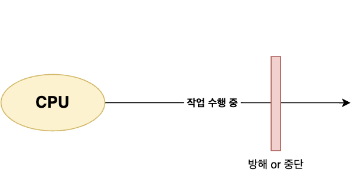

# 인터럽트 
* CPU가 수행 중인 작업을 방해하는 신호
* CPU는 인터럽트 신호가 발생하면 처리 중인 작업을 멈추고 인터럽트에 응답하게 됨

  

# 1. 인터럽트 처리 과정

## 1.1. 인터럽트 신호 확인
* CPU가 HW나 SW에 관한 작업을 실행하던 도중에 인터럽트가 발생하여, 
해당 작업이 CPU에 인터럽트 신호를 보냄
* 신호를 보냄과 동시에 CPU가 작업하던 명령을 중단하고 인터럽트 신호를 확인함

## 1.2. 인터럽트 여부 확인
* CPU에선 실행 사이클이 끝나고 나서 확인된 인터럽트 신호를 인터럽트 플러그를 통해 인터럽트를 받아드릴 수 있는지 확인함
    - **인터럽트 여부가 확인될 경우:** 실행 중인 작업을 중지하고 발생한 인터럽트를 확인함
    - **인터럽트 여부가 확인이 안될 경우:** 인터럽트 요청이 와도 그 요청을 무시함

## 1.3. 현재 상태 저장
* `프로그램 카운터(PC)`, `레지스터`를 `Stack`에 저장 (백업)

## 1.4. 인터럽트 서비스 루틴(ISR) 실행
* CPU는 <U>인터럽트 백터를 참조</U>하여 해당 인터럽트에 대한 `서비스 루틴(ISR)`이 저장된 메모리 주소를 찾아 실행함

## 1.5. 인터럽트 완료와 복구
* ISR 작업이 끝나면, 스택에 저장한 PC와 레지스터 작업을 다시 CPU에 복구함

## 1.6. 기존 작업 재개
* 원래 실행 중이던 프로그램의 다음 명령어로 돌아가 작업을 계속함

  

# 2. 인터럽트 종류 

## 2.1. 동기 인터럽트 (SW 인터럽트, 예외)
* CPU가 명령을 처리하는데 예상치 못한 상황이 발생할 때 발생하는 인터럽트 
* CPU가 명령어 처리 중에 발생한 인터럽트여서 `예외 (Exception)` 라고도 부름

## 2.2. 비동기 인터럽트 (HW 인터럽트)
* CPU가 외부 장치(입출력장치)에 대한 명령어를 효율적으로 처리하기 위해 발생하는 인터럽트
* `막을 수 없냐` 를 기준으로 우선 순위가 높아짐

  

# 3. 예외 (SW 인터럽트, 동기 인터럽트)

## 3.1. 예외의 종류

### 3.1.1. 폴트(Fault)

* 예외가 발생하면 CPU가 하던 일이 중단 되고 발생한 예외를 처리함.
* 예외 처리 후, 원래 하던 작업으로 돌아와 재개함
* 복구(⭕️)

### 3.1.2. 트랩 (Trap)

* 예외를 처리한 직후에 예외가 발생한 <U>다음 지점으로 실행을 재개함</U>
* **의도된** system call 후 복귀
* 복구(⭕️)

### 3.1.3. 소프트웨어 인터럽트
* 사용자 프로그램이 의도적으로 발생시키는 인터럽트 (system call) 
* 보통 트랩으로 간주함
* 복구(⭕️)

### 3.1.4. 중단 (Abort)

* 프로그램을 종료할 수 밖에 없는 심각한 오류를 발견했을 때 발생
* 복구(❌)