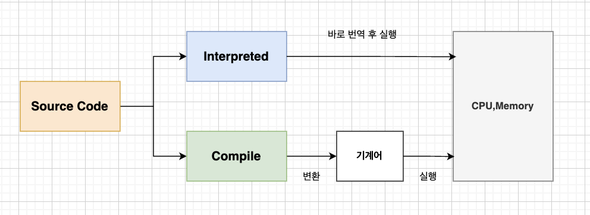

# 인터프리터 VS 컴파일

## 인터프리터 언어 (Interpreted Language)
* 개발자가 작성한 코드를 인터프리터라는 프로그램이 한 줄씩 해석하여 실행하는 방식을 사용함.
* 실행할 때마다 코드를 해석하고 실행하기 때문에 컴파일러 언어보다 속도가 느림.

**동작 과정**
1. 개발자가 소스 코드를 실행함.
2. 실행과 동시에 인터프리터가 코드를 한 줄씩 해석하고 실행함.

  

## 컴파일 언어 (Compiled Language)
* 개발자가 작성한 코드를 기계어로 변환한 후 기계어 코드를 실행하는 방식을 사용함.
* 한 번에 번역하고 실행하기 때문에 실행 속도가 빠름.
    * 여기서 기계어로 변경하는 과정을 컴파일이라고 함.

**동작 과정**
1. 개발자가 소스 코드를 컴파일함.
2. 컴파일러가 모든 소스 코드를 기계어로 변환함.
3. 변환된 기계어 코드를 컴퓨터가 실행함.
4. 컴파일 도중 에러가 발생하면 해당 프로그램은 더 이상 실행되지 않음.