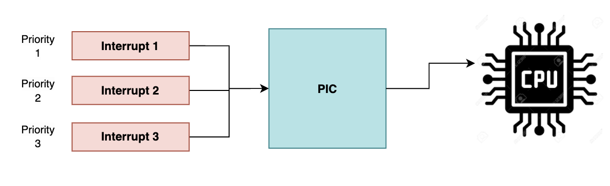

# 입출력 장치의 입출력 방법

## 1. 프로그램 제어 방식 (Program I/O)
* 프로그램 속 명령어로 입출력 장치를 제어하는 방법
* CPU에서 입출력 장치가 준비가 될 때까지 대기하거나, `폴링 방식`을 사용하여 장치의 상태를 지속적으로 확인하며 준비가 완료되면 데이터를 주고 받음
* 구현이 간단하지만, CPU가 직접 입출력을 관리하므로, 성능이 저하될 수 있음

| **특징**             | **메모리 맵 I/O**                                         | **고립형 I/O**                                             |
|----------------------|-----------------------------------------------------------|-------------------------------------------------------------|
| 주소 공간            | 메모리 주소 공간에 입출력 장치가 포함됨                   | 메모리와 별도로 입출력 장치가 독립된 주소 공간을 가짐      |
| 명령어               | 메모리 접근 명령어(`LOAD`, `STORE`)를 사용                 | 입출력 전용 명령어(`IN`, `OUT`)를 사용                      |
| 복잡성               | 소프트웨어적으로 더 간단                                  | CPU 명령어 집합이 더 복잡                                   |
| 성능                 | 메모리 접근과 입출력 작업이 충돌할 수 있음                 | 메모리와 입출력이 분리되어 충돌 가능성이 적음               |
| 주소 공간 효율성     | 메모리 공간이 줄어들 수 있음                              | 메모리 주소 공간을 낭비하지 않음                            |
| 하드웨어 설계        | 복잡해질 수 있음                                           | 상대적으로 간단                                             |
| 캐시 적용 가능성     | CPU 캐시 최적화가 가능                                     | 캐시를 활용하기 어려움                                      |

1. CPU에서 장치 컨트롤러의 제어 레지스터에 쓰기 명령을 보냄
2. 상태 레지스터에서는 하드 디스크의 상태를 확인하고 상태 값을 저장함
3. CPU에서 상태 레지스터의 값을 읽어보며 장치에서 준비가 되었으면 데이터를 전송함

  

## 2. 인트럽트 제어 방식 (Interrupt-Driven I/O)
* 인트럽트를 사용하여 입출력 장치가 데이터를 전송하거나 수신할 준비가 완료되면, CPU에게 인트럽트 신호를 보내 입출력 작업을 처리하는 방식
* 위와 같은 방식을 사용하여 장치가 준비 될때 까지 CPU는 다른 작업을 수행할 수 있음

### 2.1. PIC (Programmable Interrupt Controller)

* 다중 인터럽트가 발생했을 경우 인터럽트가 먼저 처리 되어야할 순서(우선순위)에 따라 CPU에서 처리해야하는데 이때 필요한 장치
* 각 HW의 인터럽트의 우선순위를 판별하여 CPU에 알려주는 장치

  

## 3. DMA 방식 (Direct Memory Access)
* CPU의 개입 없이 입출력 장치와 메모리 간에 데이터를 주고 받을 수 있는 방식
* CPU의 부담을 줄일 수 있고, 입출력 작업이 향상 될 수 있음
* CPU 대신 `DMA 컨트롤러가` 입출력 작업을 관리하고, 입출력 작업이 완료되면 DMA가 CPU에게 보고를 올리는 형식으로 진행됨

1. CPU는 DMA 컨트롤러에게 메모리간의 데이터 전송을 넘김
2. DMA 컨트롤러는 데이터를 직접 메모리에 저장하거나, 가져옴
3. 가져온 데이터를 장치 컨트롤에 전달
4. 전송이 완료되면 DMA 컨트롤러에서 CPU에게 인터럽트를 전송하여 작업이 끝났다고 알림