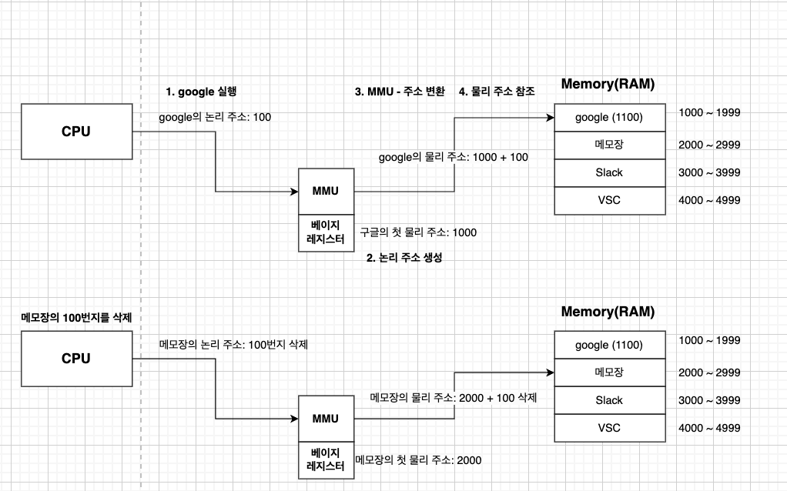

# 주소 공간

## 논리 주소
* 프로그램이 실행될 때 CPU에 의해 생성되는 주소 (가상 주소 VA)
* CPU는 이 주소로 명령어와 데이터를 처리함
* 논리 주소는 물리 주소로 변환되어야 실제 메모리(RAM)에 접근할 수 있음

  

## 물리 주소
* 실제 메모리(RAM)에 저장된 주소
* 논리 주소는 물리 주소로 변환되어야 실제 메모리(RAM)에 접근할 수 있음
* 논리 주소가 MMU(메모리 관리 유닛)에 의해 변환된 값임

  

## 주소 변환 과정 

1. **프로그램 실행 요청**: 프로그램이 실행되면 CPU는 논리 주소(가상 주소)를 생성함.
2. **논리 주소 생성**: 논리 주소는 프로그램이 인식하는 가상의 주소이며, 물리 메모리의 실제 위치와는 다를 수 있음.
    * 각 프로세스마다 독립적인 논리 주소 공간을 가짐.
3. **MMU에서 주소 변환**: MMU가 베이스 레지스터(Base Register) 값을 참고하여 논리 주소를 물리 주소로 변환.
4. **변환된 물리 주소 접근**: 변환된 물리 주소를 이용해 실제 메모리(RAM)에서 데이터를 가져옴.
5. **메모리 삭제 요청**: 메모장의 논리 주소(100번지)를 삭제한다면, MMU는 물리 주소 2000 + 100 = 2100으로 변환하여 해당 메모리 영역을 삭제함.

  

## 한계 레지스터 (메모리 보호)

* 메모리 보호를 위해 사용되는 하드웨어 장치 중 하나
* 운영체제의 프로세스가 사용할 수 있는 논리 주소 공간의 크기를 지정
* 다른 프로그램 영역을 침범할 수 있는 상황을 대비하기 위함 + 실행 중인 프로그램이 다른 프로그램에 영향을 받지 않기 위함

  

**한계 레지스터 구하는 공식**

`한계 레지스터 값 = 프로세스의 메모리 크기 - 1`

  

### 한계 레지스터 동작 과정 

**한계 레지스터 동작 과정을 나타낸 다이어그램**

**동작 과정 예시**

1. CPU가 메모장의 논리 주소 1100번지를 삭제하려고 시도
2. 논리 주소 1100이 한계 레지스터 값보다 큼 → 주소 침범 발생
3. CPU가 인터럽트(Trap) 발생 → 메모리 접근 오류 처리