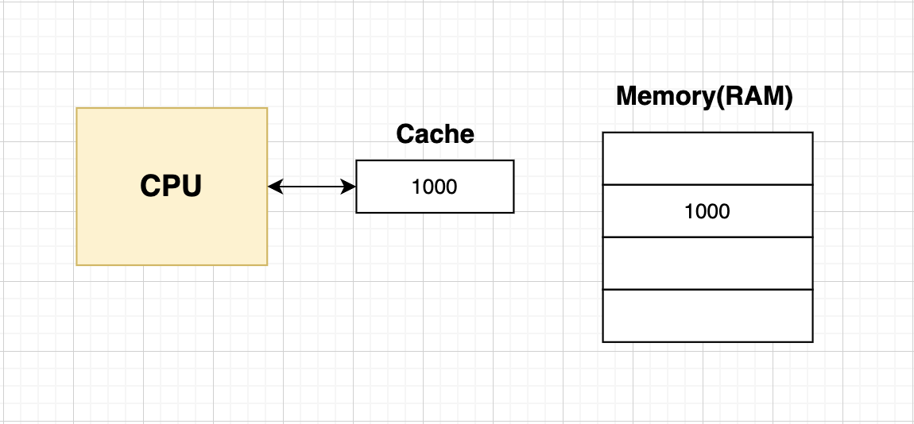

# 캐시 메모리

* CPU와 메모리와의 속도차이를 개선하기 위해 설계된 고속 메모리
* 주로 사용하는 명령어나 데이터를 임시로 저장하여 CPU의 속도를 더 빠르게 할 수 있음
* CPU와 메모리 사이에 위치해 있고, 레지스터보단 용량이 크고 메모리보다 빠른 SRAM 기반의 저장장치

  

## 저장 장치 계층 구조

  

## 캐시 메모리 종류

* **L1 cache:** CPU 코어에 가장 가까운 곳에 있음
* **L2 cache:** L1 다음으로 코어에 가까이 있음
* **L3 cache:** 코어 외부에 있음

  

## 캐시 히트

* 캐시 메모리가 CPU가 사용할 법한 자주 사용한 대상을 예측하여 저장 후 해당 예측이 맞아 CPU에서 활용되는 경우

  

## 캐시 미스

* 캐시 메모리가 CPU가 사용할 법한 데이터를 찾지 못해 메모리나 디스크에서 직접 가져오는 경우

  

## 참조 지역성의 원리
프로그램이 실행될 때, 메모리의 접근 패턴이 특정 지역에 집중된다는 원리 

1. CPU는 최근에 접근했던 메모리 공간에 다시 접근하려는 경향이 있음
2. CPU는 접근한 메모리 공간 근처를 접근하려는 경향이 있음

### 시간 지역성 
CPU가 최근에 접근한 메모리 공간에 다시 접근할려는 경향을 말함.

고속 메모리인 캐시는 시간 지역성의 특징을 이용해
최근에 사용한 데이터를 저장해두고, CPU가 동일한 데이터를 요청할때 빠르게 제공할 수 있음
  

### 공간 지역성
CPU가 접근한 메모리 근처를 접근하려는 경향을 말함

캐시는 메모리를 특정 블럭 단위로 읽고 저장하는데,
근처에 있는 데이터를 미리 가지고 와서 CPU의 접근을 최적화 함