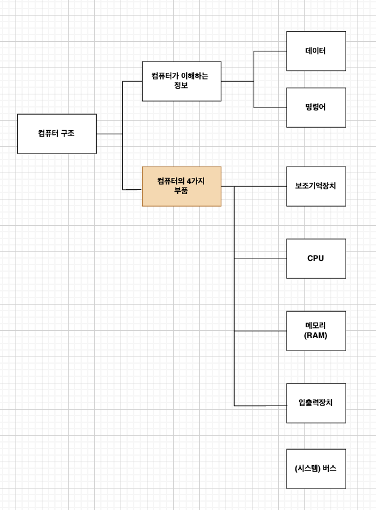
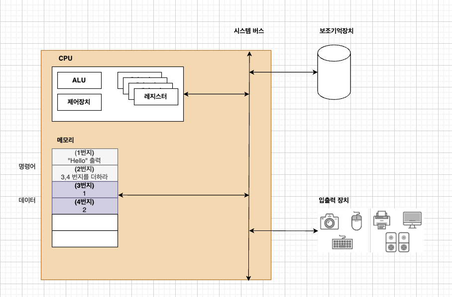

# 컴퓨터 구조의 큰 그림

## 컴퓨터를 구성하는 요소 

### 1. 컴퓨터가 이해하는 정보 (SW)
* **데이터**
    * 숫자, 문자, 이미지, 동영상과 같은 <U>정적인 정보</U>
    * 컴퓨터와 주고 받는 정보
    * 명령어 처리를 위한 일종의 리소스 
* **명령어**
    * 컴퓨터를 실질적으로 움직이게 하는 정보

 

### 2. 컴퓨터를 구성하는 부품 (HW)
* **보조기억장치**
    * 주기억 정차에 비해 가격이 저렴, 큰 용량을 가짐
    * 비휘발성 (전원이 꺼져도 내용이 사라지지 않음)
* **CPU**
    * 메모리에 저장된 명령어를 읽고, 해석, 실행함
        * **ALU**: 계산기
        * **레지스터**: CPU 내부의 작은 저장장치
        * **제어장치**: 제어신호를 보내고, 명령어를 해석하는 장치
* **메모리(RAM)**
    * 보조 기억장치 보다 가격이 비쌈
    * 휘발성 (전원이 꺼지면 내용이 사라짐)
    * 실행되는 프로그램과, 데이터, 명령어를 저장
    * 메모리에 저장된 값의 위치는 주소로 알 수 있음.
* **입출력장치**
    * 컴퓨터 외부에서 연결되어서, 컴퓨터 외부와 내부 간의 데이터 교환을 하는 역할을 수행
    * **(ex)** 마우스, 키보드, 모니터..
* **시스템버스**
    * 메인보드에 연결되어 있는 부품들(CPU, 메모리, 보조기억장치, 입출력 장치)간의 데이터를 주고 받는 통로
    * 컴퓨터에서 핵심 부품을 연결하는 것
    * **구성**
        * **주소 버스**: 주소를 주고 받음
        * **데이터 버스**: 명령어와 데이터를 주고 받음
        * **제어 버스**: 제어신호를 주고 받음

 

## 컴퓨터의 기존 동작 원리

### CPU 동작 과정
1. **명령어 인출 -> 해석 -> 실행**
* 메모리의 1번지에 있는 "Hello" 출력 명령어를 가져옴(인출)
* "hello"를 출력 해야한다는 것을 이해함 (해석)
* "hello"를 화면에 출력 (실행)
* 메모리의 다음 번지(2번지)에 있는 명령어를 가져옴 
