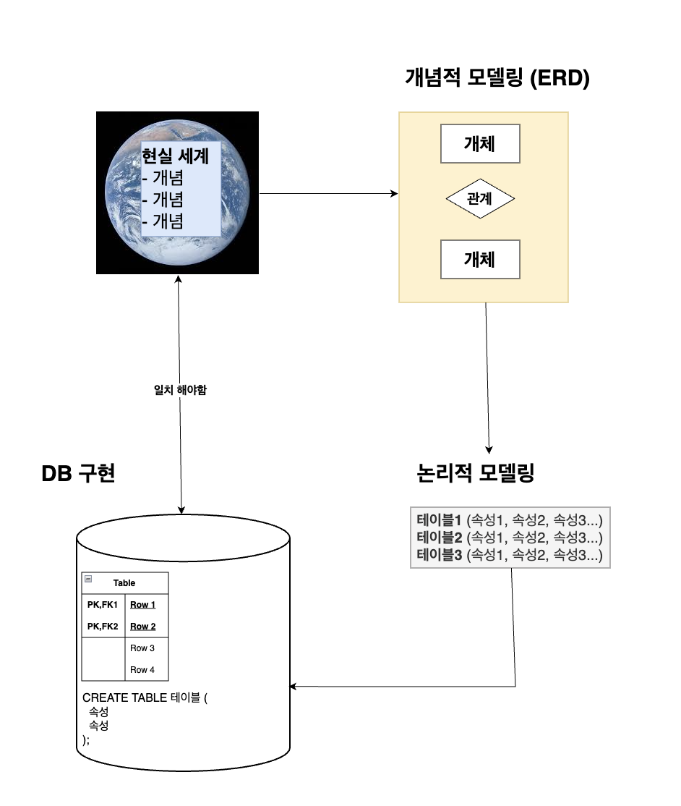

# 목차
* [모델링의 개요](#데이터베이스-모델링)
* [DB 생명 주기](#1-표현)
   1. [요구사항 수집 및 분석](#1-요구사항-수집-및-분석)
   2. [설계](#2-설계)
   3. [구현](#3-구현)
   4. [운영](#4-운영)
   5. [유지보수](#5-유지보수)
  

# 데이터베이스 모델링
* 현실 세계의 데이터를 데이터 베이스에 저장할 수 있도록 설계하는 과정
    * 어떤 정보를 어떻게, 어떤 관계로 저장할 것인지 정의하는 작업

  

## 데이터 베이스 생명 주기

### 1. **요구사항 수집 및 분석**
* 시스템이 어떤 데이터를 다뤄야 하는지, 어떤 기능이 필요한지 정확하게 파악하여
데이터베이스 설계의 범위와 방향을 결정하는 단계
* <U>비지니스 흐름을 이해하는 것이 중요함</U>

### 2. **설계**

* `개념적 모델링`, `논리적 모델링`, `물리적 모델링`을 하여 DB 도면(스키마)을 생성 
    *  **개념적 모델링**:
        - 현실 세계의 데이터를 추상화하여 개념적으로 표현
        - ERD(Entity-Relationship Diagram) 작성
    * **논리적 모델링**:
        - 개념적 모델을 논리적 데이터 모델로 변환
        - 엔티티를 테이블로, 속성을 컬럼으로 구체화
        - 관계형 DB 논리에 맞춰 기본키, 외래키 정의
        - 정규화를 통해 데이터 일관성과 무결성 확보
    * **물리적 모델링**:
        - 논리적 모델을 실제 DBMS에 맞게 구현
        - 데이터 타입, 인덱스, 파티셔닝 등 정의

### 3. **구현**
* 설계 단계에서 설계된 스키마를 이용해 실제 DBMS를 활용하여 구현함
* `SQL`을 통해 `테이블`, `제약조건(PK, FK, NOT NULL ..)`, `인덱스` 등을 생성하고 필요한 초기 데이터를 삽입`(INSERT)`함

### 4. **운영**
* 애플리케이션이 DB에 연결되어 실시간으로 데이터를 `CRUD`하며 실제 서비스가 운영되는 단계

### 5. **유지보수**
* DB 운영에 따른 시스템을 모니터링 하여 문제점을 개선(인덱스 조정 등..)함
* 요구사항이 변경되면 테이블 구조도 수정함
* 보안 패치, 백업 및 복구 전략.. 도 이 단계에서 실행함