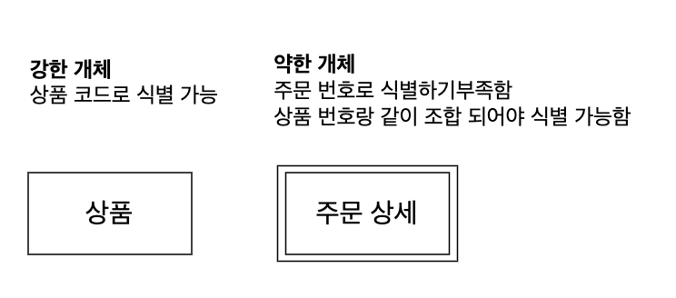
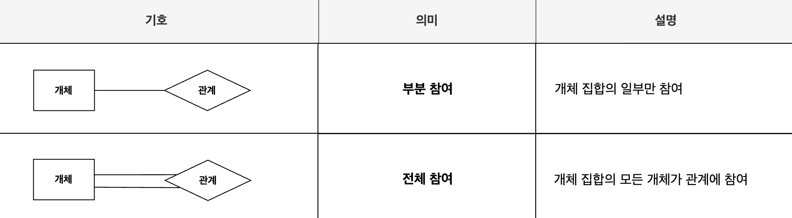

# ER(Entity Relationship) 표기법

* 현실 세계의 사물이나 개념을 `개체(Entity)`와 `관계(Relationship)`로 표현하는 데이터 모델링 방식
* 개체는 `고유한 속성(Attribute)`을 통해 식별되며, 개체들 간에는 논리적인 `관계(Relationship)`가 존재함

  

# 1. 개체
* 현실 세계의 사물이나 개념을 추상화한 독립적인 실체

## 1.1. 개체 타입

* 비슷한 특성을 가진 개체들의 집합(그룹)
* 데이터 베이스에선 **하나의 테이블로 구현됨**
* ERD에선 직사각형으로 표현
* `강한 타입과` 약한 `타입`으로 나눌 수 있음

    * `강한 타입`: 다른 개체의 도움이 없이 독립적으로 식별이 가능한 개체
    * `약한 타입`: 독자적으론 삭별할 수 없고 <U>다른 개체의 도움(FK)</U>이 필요한 개체

  

# 2. 속성
* `개체(Entity)`의 <U>특성을 설명하는 데이터</U>의 항목
* 데이터 베이스에선 **테이블의 컬럼(열)으로 구현됨**
* ER 다이어그램에선 타원 모양으로 표현함 (형태에 맞게 변경됨)

## 2.1. 속성의 유형
* 값의 **형태에 따라 여러 유형으로 구분**됨

  

# 3. 관계
* 두 개 이상의 `개체(Entity)` 사이의 상호 작용이나 연관성을 표현하는 요소
* 객체들이 어떻게 연결되었는지, 어떤 특성을 공유하는지 나타냄
* ER 다이어그램에선 마름모 모양으로 표현함 

## 3.1. 관계의 유형
* 관계 타입은 개체 타입이 관계를 맺은 형태(차수와 대응수)에 따라 여러 유형으로 구분됨

### 3.1.1. 관계 차수
* 관계에 참여하는 `개체(Entity)의`  수를 나타내는 개념

### 3.1.2. 관계 카디널리티 (대응 수)
* 관계에 참여한 개체들이 실제로 참여하는 개별 개체 수를 의미

### 3.1.3. 참여 제약조건 
* 집합 내 모든 개체가 관계에 참여하는지에 대한 유무에 따라 부분/전체 참여로 구분함

