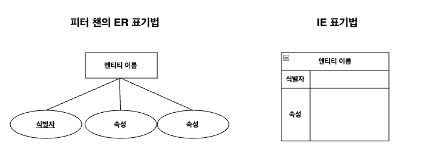

# 목차
1. [IE 개요](#ie-표기법)
2. [IE 표기법의 표현](#1-표현)
   1. [개체의 표현](#11-개체의-표현)
   2. [속성의 표현](#12-속성의-표현)
   3. [관계의 표현](#13-관계의-표현)
  

# IE 표기법
* ER(Entity Relationship) 모델을 시각적으로 표현할 때 사용하는 표기법 중에 하나
* 데이터베이스의 개체, 속성, 관계를 표현할 규칙과 기호 체계를 제공
* `관계 대응 수`를 새발 모양의 기호로 표현하여 새발 표기법이라고도 부름

  

## 1.표현

### 1.1. 개체의 표현
* **사각형**으로 나타냄
* 엔티티 이름에 개체의 이름을 작성
* 강한 개체일 경우, 식별자에 `고유한 식별자(PK)`를 포함시킴
* 약한 개체일 경우, 부모 개체의 식별자를 참조하여 식별자(FK)를 포함시킴
* 개체는 데이터베이스에서 독립적으로 존재할 수 있는 실체를 나타냄

### 1.2. 속성의 표현
* 개체(Entity)와 함께 사각형 내부에 포함하여 표현

### 1.3. 관계의 표현
