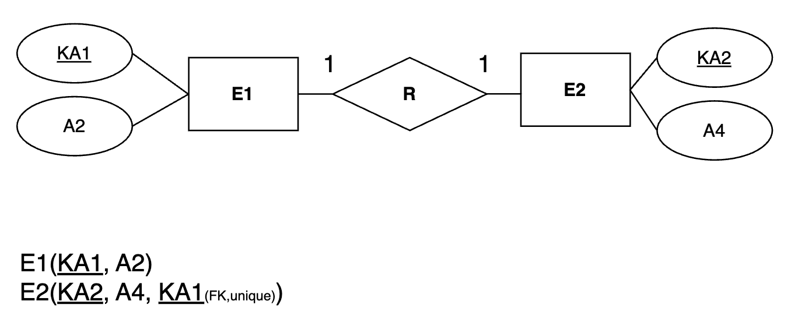

# 목차
* [개요](#-사상_mapping-)

  

# 사상(Mapping)
* `ER 모델 → 관계형 모델(RDB)`로 변환하는 변환 규칙
* `개체`, `속성`, `관계`를 `Relatuion Table`로 변환하는 작업

  

## Mapping 알고리즘 

### 1. 강한 개체 타입
* `개체(Entity)` → `테이블`
* `일반 속성` → `컬럼`
* `기본키`, `외래키` → `테이블의 PK,FK`로 설정
### 2. 약한 개체 타입
* 자신의 고유 PK가 없음
* `자신의 키` + `강한 개체 타입의 키` 로 `복합키`를 구성

### 3. 이진 1:1 관계 타입

* 두 개체 중 한 쪽에 외래키를 넣음
* 그 외래키에는 `UNIQUE 설정` 필요 (1:1 관계 보장)

### 4. 이진 1:N 관계 타입

* `N쪽`에 `1쪽`의 `PK`를 `외래키`로 추가

### 5. 이진 M:N 관계 타입

* 중간 테이블 생성
* 양쪽 개체의 PK를 생성된 테이블의 복합키로 설정

### 6. N진 관계 타입

* 참여하는 모든 개체의 `PK`를 `외래키`로 포함

### 7. 다중 값 속성 

* 다중 값 속성은 따로 테이블로 분리
* `원래 개체의 PK` + `다중 속성값`을 복합키로 구성

