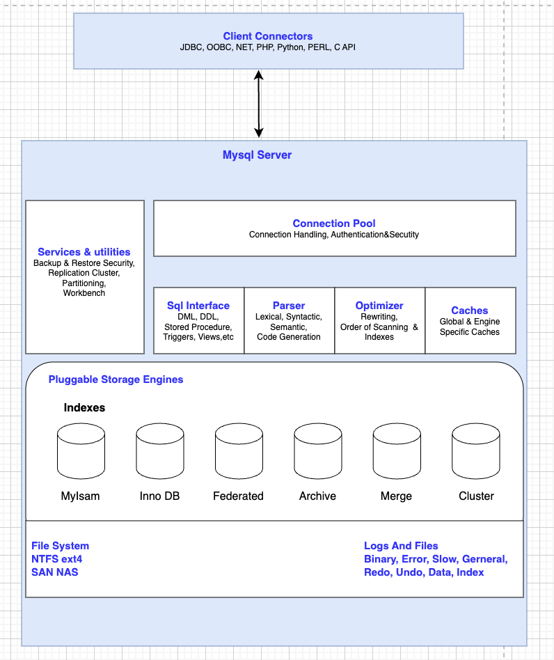

# Mysql 아키텍쳐

* MySQL이 내부에서 쿼리를 어떻게 처리하고 데이터를 어떻게 저장하고 관리하는지 구성한 구조

  

# Mysql 3 Layer

## 1. Client Layer 
* 클라이언트에서 서버로 연결하는 계층
* 개발자가 MySQL에 접속할 수 있게 해주는 도구들 (JDBC, ODBC, Python ...)

  
                                         
## 2. Mysql Server Layer
* Mysql 아키텍처의 핵심 부분
* 쿼리 처리, 인증, 파싱, 최적화 등.. 다양한 작업 수행

### 2.1. **Connection Pool**
* 클라이언트 연결 관리, 인증, 보안 관련 처리를 담당
* 사용자 인증(Login), 세션 유지 등을 담당

### 2.2. **Sql Interface**
* Sql 명령어(DML, DDL, DQL...)를 받고 처리함 

### 2.3. **Parser**
* Sql문을 해석함
    * `Lexical` - 토큰 분해
    * `Syntactic` - 구조 분석
    * `Semantic` - 문법 검사 
    * `Code Generation` - 코드 생성

### 2.4. **Optimizer**
* 쿼리를 최적화 해서 더욱 성능을 높이는 역할 수행
    * 어떤 인덱스를 쓸지, 어떤 테이블 부터 스캔할지 결정
    * 인덱스의 사용여부 결정

### 2.5. **Caches**
* 캐시를 사용하여 자주 사용하는 데이터나 쿼리 결과를 빠르게 가져옴
* `Global Cache`: 전체 서버 공통 캐시 (쿼리 캐시)
* `Engine Specific Cache`: Inno DB Buffer Pool 같은 엔진별 캐시 

### 2.6. **Services & Utilities**
* 백업/복원, 보안, 클러스터링, 파티셔닝, 워크벤치.. 같은 관리 툴 제공

  
                                         
## 3. Storage Engine Layer 
* 실제로 데이터를 저장하는 계층
* 플러그인 방식으로 여러 저장 엔진을 사용함

* **Storage Engine 종류**
    * `MyISAM`: 오래된 기본 엔진, 읽기 성능은 빠름, 트랜잭션 없음
    * `InnoDB`: 현재 기본, 트랜잭션 지원, 외래 키 지원
    * `Federated`: 외부 DB와 연결
    * `Archive`: 대량 데이터 저장용, 읽기 전용
    * `Merge`: 여러 MyISAM 테이블을 하나처럼
    * `Cluster`: 고가용성 클러스터 구성

