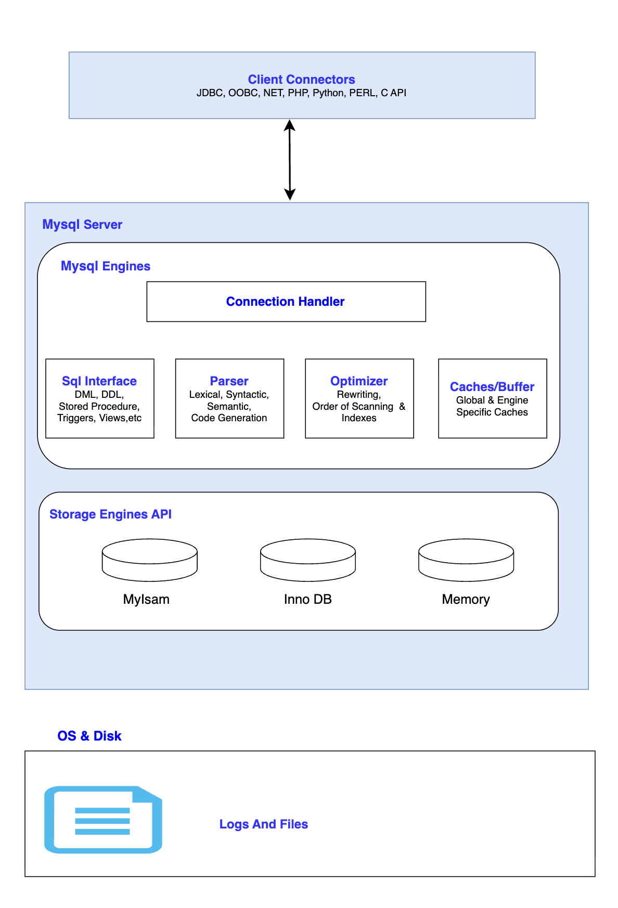

# MySQL 아키텍처

* MySQL이 내부에서 쿼리를 어떻게 처리하고 데이터를 어떻게 저장하고 관리하는지 구성한 구조
* MySQL 서버는 크게 `MySQL 엔진`, `스토리지 엔진`으로 구분할 수 있음

<br></br>


# 1. MySQL 엔진
* 클라이언트의 요청을 받고 SQL 을 분석, 최적화 하는 등의 DBMS의 두뇌 역할을 수행 
* 요청을 처리, 파싱, 최적화, 인증 등의 작업을 수행

## 1.1. 커넥션 핸들러 
* `클라이언트(JDBC, ODBC...)`로부터의 DB연결을 요청하는 순간부터 연결이 끊어지기 전까지 모든 라이프 사이클을 관리
* `사용자(클라이언트)`의 **인증**과 **권한**을 확인하며, 클라이언트마다 <U>독립된 스레드를 할당</U>하여 쿼리를 처리할 수 있도록 관리 

```shell
0. 클라이언트 요청 
1. 연결 수락
2. 인증, 권한 체크
3. 스레드 할당
4. 쿼리 전달
```

## 1.2. SQL 인터페이스
* 커넥션 핸들러를 거쳐 들어온 클라이언트의 요청 SQL문을 **가장 먼저 받아**들임
* 클라이언트가 요청한 SQL문(DDL, DML..) 뿐만 아니라 프로시저, 트리거와 같은 `명령들을 받아서 DB 내부에서 이해할 수 있는 형태`로 변환하고 전달
* 다양한 클라이언트 툴 (CLI, Workbench, web server)에서 보내는 서로 다른 요청을 <U>하나의 통일된 인터페이스 수용하는 역할을</U> 수행
## 1.3. 파서
* SQL 인터페이스를 넘어온 SQL문장(트리거, 프로시저 등을 포함)을 분석하여 컴퓨터가 이해할 수 있는 Tree구조로 쪼개고 검사하는 작업을 수행
```shell
1. 어휘 분석
    - SQL 문장을 단어 단위인 토큰으로 쪼갬
2. 구문 분석
    - 쪼갠 단어들을 조합해 문법적인 오류가 없는 검사
    - 문법적 오류가 발생하면 Syntax Error를 반환하며 실행을 중단
3. 결과물 추출
    - 문법 검사가 통과 되면 내부적으로 Parser Tree 라는 결과물을 만들어 옵티마이저에 전달
```

## 1.4. 옵티마이저
* 파서에서 전달 받은 Parser Tree를 바탕으로 데이터를 어떻게 가져오는 것이 가장 빠르고 비용이 적게 들지를 계산


## 1.5. 캐시 & 버퍼 
* HDD나 SSD에서 데이터를 직접 가져오면 작업 속도가 굉장히 느려지기 때문에 DB 효율을 끌어올리기 위해 <U>자주 사용하는 데이터나 이전에 계산해둔 결과를 `메모리(RAM)`에 올려두고 재사용</U>하는 공간
* `버퍼 풀(Buffer Pool)` 이나 `키 캐시(Key Cache)` 등이 존재


<br></br>
                                         
# 2. 스토리지 엔진 
* MySQL 엔진이 내린 명령에 따라, 실제 디스크에 데이터를 저장하거나 읽어오는 IO를 수행
* MySQL에선 **플러그인 아키텍처**를 채택하여, <U>목적에 맞게 스토리지 엔진을 선택</U>하여 사용할 수 있음. 
* 실제 데이터의 읽기/쓰기, 인덱스 관리, 잠금, 트랜잭션 처리 등을 담당


### 2.1. [InnoDB](<../스토리지 엔진 아키텍처/InnoDB.md>)
* 현재 MySQL의 `기본(default)`엔진
* 트랜잭션을 지원하며, 외래키와 행단위 잠금을 지원

### 2.2. [MyISAM](<../스토리지 엔진 아키텍처/MyISAM.md>)
* MySQL 5.5 이전에 주로 사용되던 기본 스토리지 엔진
* 트랜잭션을 지원하지 않으며, 테이블 단위 잠금을 사용
* <U>단순 읽기 작업이 많을 때</U> 가볍고 빠름

### 2.3. **Memory**
* 데이터를 디스크에 저장하는 것이 아니라 RAM에 올려 놓아서 매우 빠름
* 서버가 꺼지면 데이터가 날아가는 <U>휘발성 임시 테이블용</U> 엔진


<br></br>
                                         
# 3. OS & Disk

## 3.1. OS
* MySQL 서버가 구동하는 뼈대
* 파일 시스템 관리, 프로세스와 스레드 스케줄링을 담당

## 3.2. Disk (물리 저장소)
* 실제 `데이터 파일(.ibd)`, `로그 파일(Redo, Undo, Binary Log)` 등이 영구적으로 저장되는 물리적인 공간
* 스토리지 엔진은 최종적으로 이 영역과 통신하여 데이터를 안전하게 기록(저장)함

