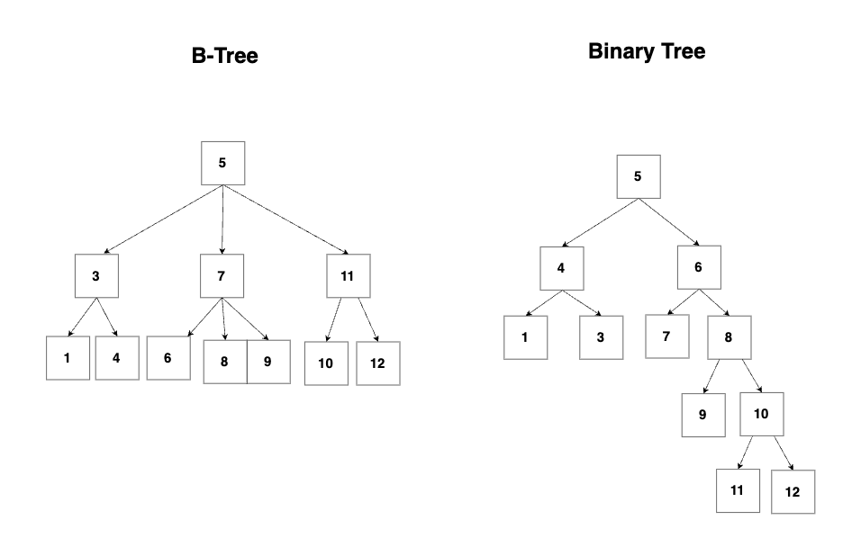

# 인덱스 (index)
*  테이블에 대한 동작의 속도를 높여주는 자료 구조
    * 투플의 키 값에 대한 물리적 위치를 기록한 자료 구조
* 대부분의 RDBMS의 구조는 `B-Tree 구조`로 되어 있음

<br></br>

## B-Tree

* 이진 트리를 확장한 것으로, 하나의 노드가 가질 수 있는 갯수가 2개보다 큰 트리 구조
    * `이진 트리`: 2개
    * `B-Tree`: N개 

### B-Tree 특징
1. 각 `노드(node)`는 `키(key)`값과 `포인터(pointer)`를 가짐
2. `키(key)값`은 기본적으로는 **오름차순**으로 정렬되어 있음
3. 모든 leaf 노드가 같은 깊이에 있음
    * 키 값이 새로 추가되거나, 삭제 될 경우 동적으로 노드를 분할하여 균형 상태를 유지함
4. 검색, 삽입, 삭제 속도가 빠른 편 
    * 시간 복잡도: `O(log N)`

<br></br>

## 인덱스의 특징
1. 인덱스는 테이블에서 한개 이상의 속성을 이용하여 생성함
2. B-Tree 기반이라 빠른 검색과 접근 효율이 높음
3. 테이블 보다 작은 공간을 점유함 (속성 정렬 + 데이터의 포인터만 가짐)
4. 데이터를 수정, 삭제 같이 수정할려면 인덱스를 재구성 해야함 (때문에 적절하게 사용해야 성능적에서 이점을 봄)

<br></br>

## 인덱스 문법

### 인덱스 생성
* **인덱스 생성시에 고려 사항**
    1. `WHER`E 절에 자주 사용하는 속성이여야 함
    2. 조인에 자주 사용되는 속성이여야 함
    3. 테이블 하나에 여러 인덱스가 있으면 속도가 느려질 수 있음
    4. 속성이 가공되는 경우 사용하지 않음
    5. 속성의 선택도가 낮을때 사용하면 매우 유리함
```sql
-- 기본 문법
CREATE INDEX 인덱스이름 ON 테이블이름(컬럼1, 컬럼2, ...);

-- 중복을 허용하지 않는 인덱스 생성
CREATE UNIQUE INDEX 인덱스명
ON 테이블명 (컬럼명);

-- 복합 인덱스 생성
-- 여러 컬럼에 인덱스를 생성함
CREATE INDEX 인덱스이름 ON 테이블이름(컬럼1, 컬럼2, ...);


-- 클러스터 인덱스 생성
CREATE TABLE 테이블명 (
    컬럼명 데이터타입 PRIMARY KEY
);

-- 보조 인덱스 생성 
CREATE INDEX 인덱스명
ON 테이블명 (컬럼명);
```

### 인덱스 재구성
* B-Tree의 고질병인 단편화 현상을 보안하기 위한 문법
* 비어 있는 인덱스 값 때문에 인덱스를 지웠다가 다시 생성함
```sql
ANALYZE TABLE 테이블이름;
```

### 인덱스 삭제
```sql 
DROP INDEX 인덱스이름 ON 테이블이름;
```
<br></br>

## Mysql(InnoDB) 인덱스 종류

### 클러스터 인덱스 
* 연속된 키 값의 레코드를 묶어서 같은 블록에 저장하는 방식 사용
* 1개의 테이블당 1개씩만 생성이 가능함
* PK를 기준으로 만들어짐
* 실제 DB에 있는 레코드를 `B-Tree leaf 노드`에 같이 저장하는 인덱스 
```sql
CREATE TABLE users (
  id INT PRIMARY KEY, -- 클러스터 인덱스
  pw VARCHAR(20) -- leaf node에 가면 데이터도 있음 
);
```

### 보조 인덱스 
* 클러스터 인덱스를 제외한 나머지 인덱스
* `B-Tree leaf 노드`엔 실제 데이터가 아니라 PK를 저장함
* 데이터를 완벽하게 다 가져오려면 다시 클러스터 인덱스를 이용해서 가져와야함