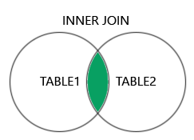
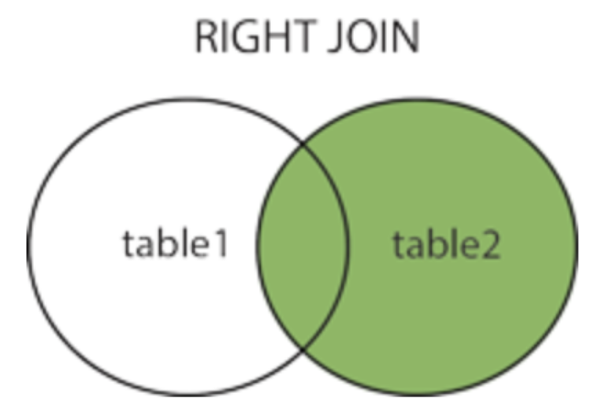
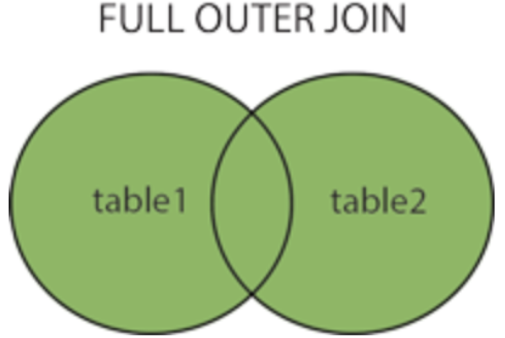

# JOIN

* 두 개 이상의 테이블을 연결해서 조회하는 방법을 제공하는 SQL 구문
    * 공통된 값을 기준으로 레코드를 합치는 것
* 컬럼(열)을 기준으로 레코드(행)을 결합하는 데 사용
* 주요 JOIN 종류:
    - `INNER JOIN`
    - `LEFT JOIN`
    - `RIGHT JOIN`
    - `FULL OUTER JOIN`


<br></br>

## INNER JOIN (내부 조인)

* 두 테이블 모두에서 일치하는 값을 가지는 행을 반환
```sql
SELECT 컬럼명
FROM <조인할려는 첫 번째 테이블>
    INNER JOIN <조인할려는 두번째 테이블>
    ON <조인 조건>
WHERE <검색 조건>
```

<br></br>

## OUTER JOIN (외부 조인)
* 두 테이블을 조인할 때 필요한 내용이 한쪽에만 있어도 결과를 추출할 수 있는 조인 방식
* 매칭 값이 나오지 않으면 Null로 채워짐

<br></br>

### Left Join
```sql
SELECT 컬럼명
FROM <조인할려는 첫 번째 테이블>
    LEFT OUTER JOIN <조인할려는 두번째 테이블>
    ON <조인 조건>
WHERE <검색 조건>
```

* 왼쪽 테이블을 기준으로 오른쪽 테이블의 일치하는 데이터를 가져옴
* 오른쪽 테이블에 해당 데이터가 없으면 Null
* 왼쪽으로 기준 잡은 테이블의 정보는 다 보여야 할 때 사용

<br></br>

### Right Join 

```sql
SELECT 컬럼명
FROM <조인할려는 첫 번째 테이블>
    RIGHT OUTER JOIN <조인할려는 두번째 테이블>
    ON <조인 조건>
WHERE <검색 조건>
```
* 오른쪽 테이블을 기준으로 완쪽 테이블의 일치하는 데이터를 가져옴
* 왼쪽 테이블에 해당 데이터가 없으면 Null
* 우선 순위가 오르쪽 테이블일 경우 시용

<br></br>

### Full Join

```sql
SELECT 컬럼명
FROM <조인할려는 첫 번째 테이블>
    FULL OUTER JOIN <조인할려는 두번째 테이블>
    ON <조인 조건>
WHERE <검색 조건>
```
* 양쪽 테이블의 데이터를 모두 가져옴
* 없는 데이터는 Null
* 두 테이블의 모든 데이터를 보고 싶은 경우에 사용