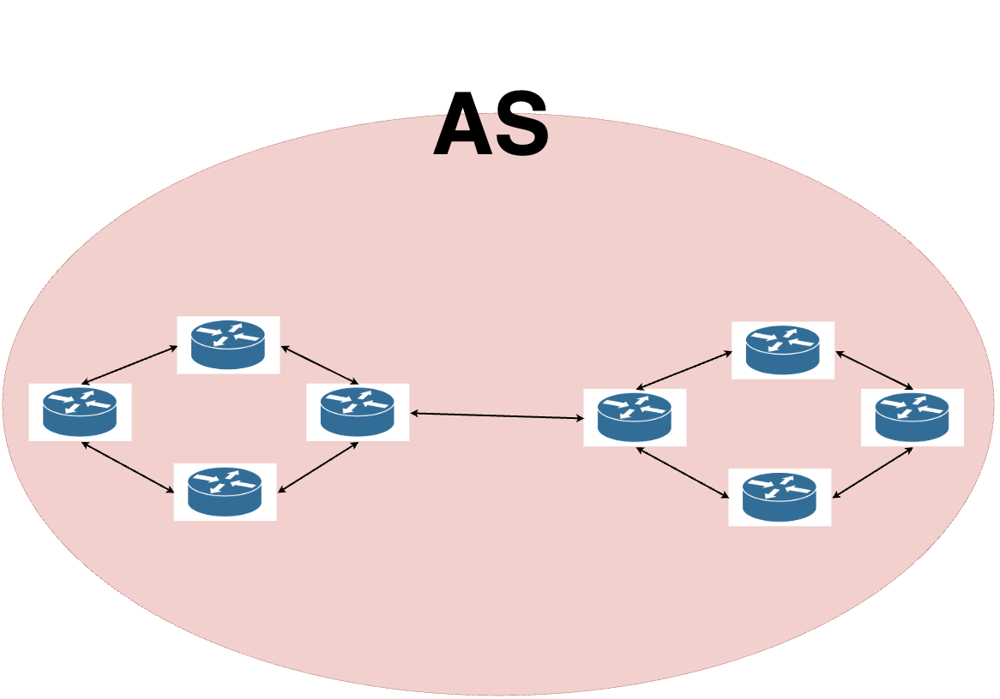
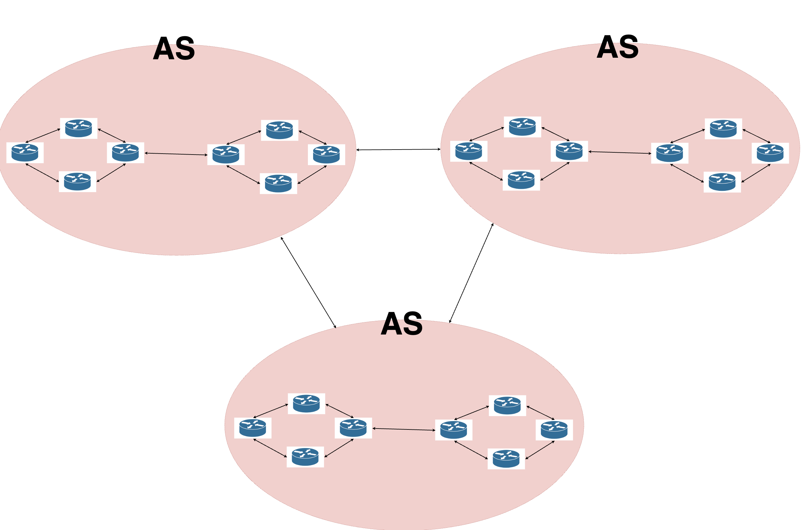
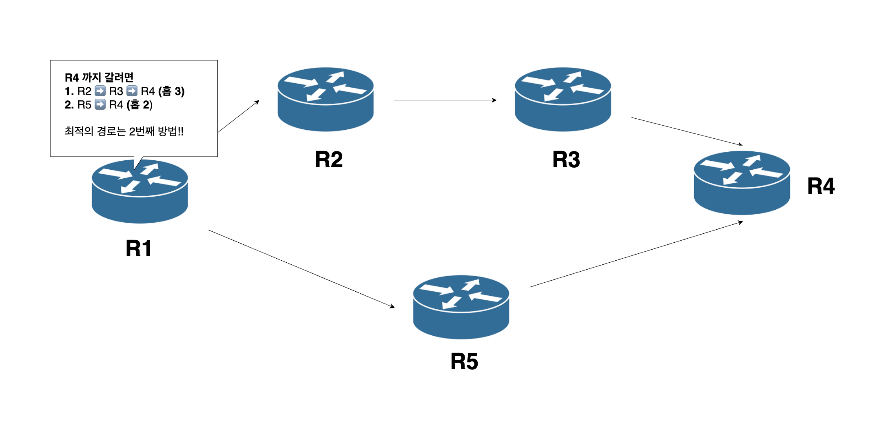
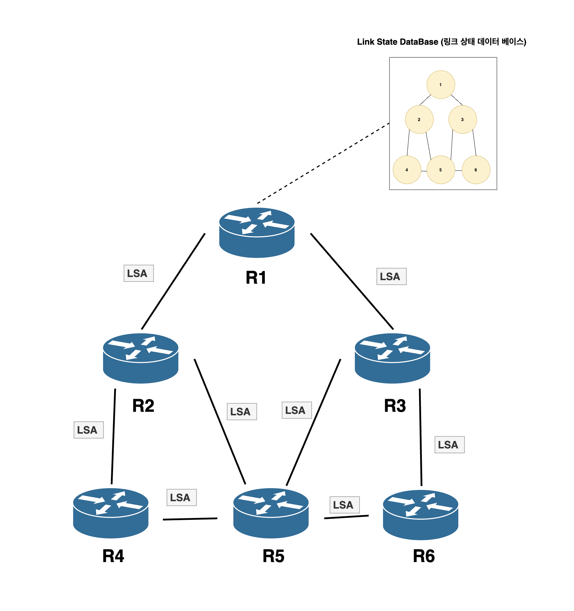
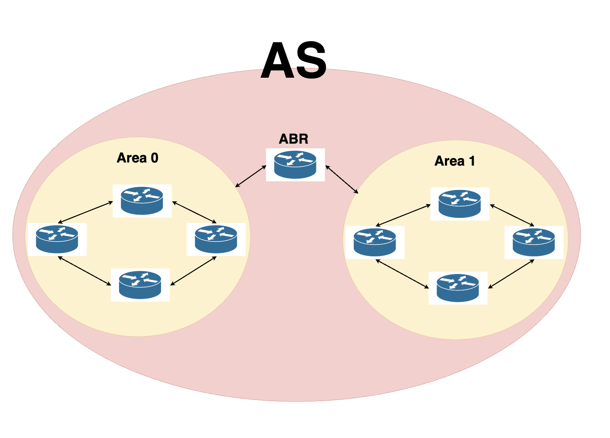
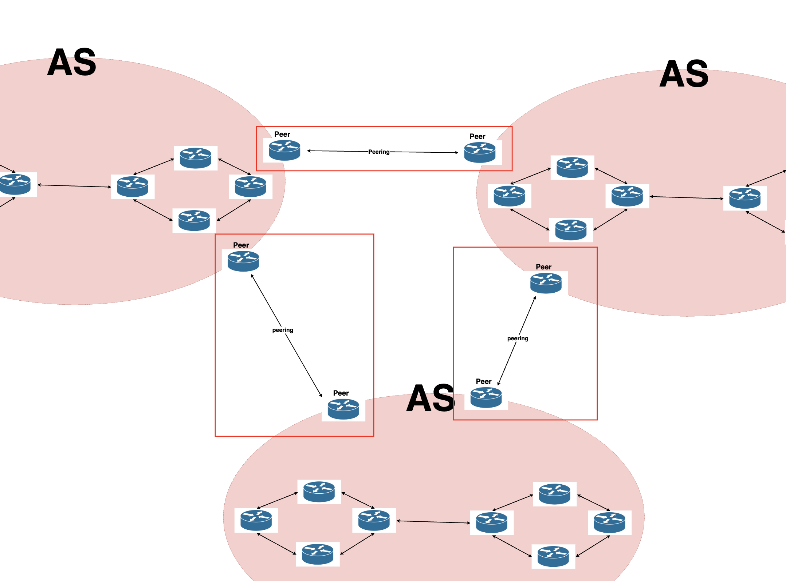

# 라우팅 
* 라우터의 핵심 기능 
* 패킷이 이동할 최적의 경로를 설정하고, 그 경로로 패킷을 이동시키고 경로를 유지하는 기술

<br></br>

## 1. 라우팅 테이블
* 라우터나 L3장비가 어떤 경로로 패킷을 전달해야할지 결정하기 위해 사용하는 테이블
* 패킷 전달을 위한 경로들의 일종의 지도(MAP)이라고 함

### 라우팅 테이블의 구성 항목

| 항목                    | 설명                                   |
| --------------------- | ------------------------------------ |
| **Destination (목적지)** | 도달하려는 네트워크 주소  |
| **Netmask** | 네트워크의 범위를 정의                       |
| **Gateway (게이트웨이), Next Hop**   | 목적지로 가기 위해 거쳐야 할 다음 라우터 주소           |
| **Interface** | 패킷을 내보낼 라우터의 포트         |
| **Metric (우선순위)**     | 경로의 비용. 숫자가 낮을수록 더 좋은 경로             |
| **Flags**             | 경로의 상태나 속성 |
* 라우팅 테이블에 없는 경로로 패킷을 경로로 보내야 할 경우 **디폴트 라우트** 라는 것으로 보냄

```shell
Routing tables

Internet:
Destination        Gateway            Flags               Netif Expire
default            192.0.0.1          UGScg                 eth0 // 디폴트 라우트
127                127.0.0.1          UCS                   lo0
127.0.0.1          127.0.0.1          UH                    lo0
169.254            link#1             UCS                  eth1      -
169.254.XXX.XXX/32 link#1             UCS                  eth1      -
169.254.169.254    link#1             UHRLSW               eth1      6
192.0.0.1/32       link#0             UCS                  eth0      -
192.0.0.1          link#0             UHLWIir              eth0      -
192.0.0.2/32       link#0             UCS                  eth0      -
192.0.0.2          xx:xx:xx:xx:xx:xx  UHLWI                 lo0
224.0.0/4          link#0             UmCS                 eth0      -
224.0.0/4          link#1             UmCSI                eth1      -
255.255.255.255/32 link#0             UCS                  eth0      -
255.255.255.255/32 link#1             UCSI                 eth1      -
```

<br></br>

## 2. 정정 라우팅
* 사용자가 <U>직접 수동으로 설정</U>한 라우팅 정보에 따라 패킷을 전달함
* 라우팅 테이블의 항목은 관리자가 명시적으로 입력
* 경로 변경 시 수동으로 수정해야 함
```shell
sudo route add -net 10.0.0.0/24 192.168.1.1
// 10.0.0.0/24 서브넷의 목적지로 가는 트래픽은 192.168.1.1을 통해 보내라
```

```shell
// 결과
Routing tables
Destination        Gateway            Flags               Netif Expire
...
10.0.0.0/24        192.168.1.1        UG                  eth0  -
```

<br></br>

## 3. 동적 라우팅
* 라우터가 자동으로 서로 정보를 주고 받아 라우팅 테이블을 생성 혹은 갱신하여 이를 통해 최적의 경로를 선택하는 방식
    * 네트워크 환경이 변경되어도 라우팅 테이블이 수시로 변경되어 자동으로 라우팅 경로가 갱신됨
* 라우터들은 최적으로 경로를 찾기 위해 라우팅 프로토콜이라는 것을 사용해 서로 정보를 공유하고, 효율적인 경로를 유지함


<br></br>

### 3.1. 라우팅 프로토콜 
* 여러 개의 라우터가 서로 연결된 네트워크에서 정보를 주고받으면서 목적지까지의 최적 경로를 찾기 위해 사용하는 통신 규약
* `AS(하나의 괸리 기관에서 일관되게 관리되어지는 네트워크 범위)` 내부인가? 외부인가? 에 따라 프로토콜 종류가 달라짐

| 분류                                  | 설명                           | 프로토콜          |
| ----------------------------------- | ---------------------------- | ---------------- |
| **IGP (Interior Gateway Protocol)** | AS 내부에서 사용하는 프로토콜     | RIP, OSPF, EIGRP |
| **EGP (Exterior Gateway Protocol)** | 서로 다른 AS에서 사용하는 프로토콜 | BGP              |

<br></br>

### 3.1.1. IGP (Interior Gateway Protocol)

* 하나의 AS 내부에서 라우터들이 서로 목적지까지의 정보를 교환할 때 사용되는 프로토콜
* 빠른 수렴 속도를 가지며 단순하게 관리할 수 있음
* **대표적인 프로토콜:** `RIP`, `OSPF`

<br></br>

### 3.1.2. EGP (Exterior Gateway Protocol)

* AS와 AS 간에 경로 정보를 교환하기 위해 사용되는 프로토콜
* 정책 기반의 라우팅을 사용함
* **유일하게 사용되는 EGP 프로토콜:** `BGP`

<br></br>

### 3.2. [IGP] RIP (Routing Information Protocol)

* 거리 벡터 기반의 라우팅 프로토콜
* 라우터들의 서로 목적지까지의 경로 거리를 기반으로 최적의 경로를 찾는 프로토콜
* 홉의 수 = 거리 
    * 즉 홉의 수가 적을 수록 최적의 경로라고 판단 함

<br></br>

### 3.3. [IGP] OSPF (Open Shortest Path Fist)

* 링크 상태에 기반하는 라우팅 프로토콜 
* 각 라우터에선 전체 네트워크의 맵을 파악해서 최단의 경로를 계산함
    * 최단 경로 검색은 `다익스트라 알고리즘`을 사용함
* **동작 과정**
    1. 각각의 라우터가 자신의 상태를 가진 LSA를 생성
    2. LSA를 연결되어 있는 라우터에게 전달
    3. 모든 라우터가 같은 LSA를 담은 LSDB를 가짐
    4. LSDB에 담긴 내용을 통해 다익스트라 알고리즘으로 최적의 경로를 계산
    5. 계산 결과를 라우팅 테이블에 반영
* `Area 기반 구조`로 설계 함


| 구성요소                         | 설명                                         |
| ---------------------------- | ------------------------------------------ |
| **AS (Autonomous System)**   | OSPF가 동작하는 전체 네트워크 범위 (회사, ISP 내부)       |
| **Area**                     | 네트워크를 논리적으로 나눈 영역. 각 Area는 자체 LSDB를 가짐     |
| **ABR (Area Border Router)** | 두 개 이상의 Area에 속한 라우터. Area 간의 라우팅 정보 전달 담당 |


<br></br>

### 3.4. [EGP] BGP (Border Gateway Protocol)

* <U>AS 간의 라우팅 정보를 교환하는데 사용되는 핵심 프로토콜</U>
* BGP 프로토콜로 통신을 할 수 있게 하는 라우터를 `피어(peer)`라고 함
* 이 피어끼리 통신할 수 있게 BGP 세션을 설정하는 과정을 `피어링(peering)`이라고 함 
* BGP는 AS 간 통신을 위한 외부 라우팅 프로토콜이므로 정책 기반의 복잡한 경로 결정이 필요함
* 단순한 거리(홉 수)가 아니라 `속성(Attribute)`과 `정책(Policy)`을 기준으로 최적 경로를 결정함


| 속성 이름      | 설명                                                                                  | 역할                                                                  |
|----------------|-----------------------------------------------------------------------------------------|----------------------------------------------------------------------------------|
| **AS-PATH**    | 목적지까지 거쳐간 AS 번호들의 목록. 메시지가 어떤 경로를 거쳐왔는지를 나타냄                     | 루프 방지에 사용되며, **AS 경로의 수가 적을수록** 우선순위가 높아짐                          |
| **NEXT-HOP**   | 다음 목적지로 패킷을 전달할 라우터의 IP 주소를 지정                                      | 실제 패킷 전달 시 **다음 홉 라우터를 식별**하고 지정하는 데 사용됨                              |
| **LOCAL_PREF** | 동일 AS 내부에서 어떤 경로를 더 선호할지 결정하는 우선순위 값 (기본값 100)                 | 값이 **클수록 더 선호되는 경로**로 간주됨. 내부 정책에 따라 AS 내부 경로 선택에 사용됨           |