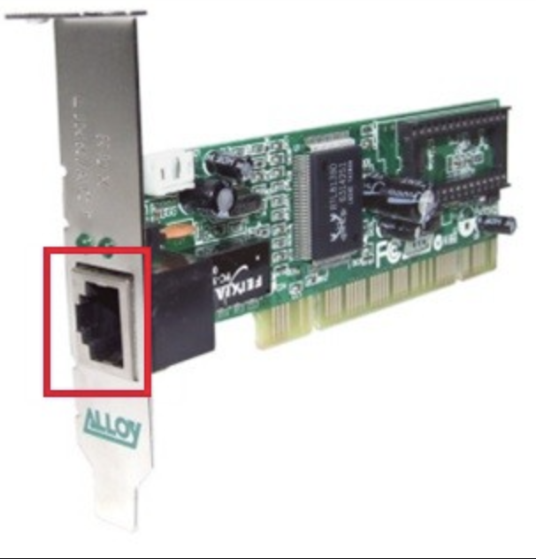

# NIC

* 컴퓨터나 서버가 네트워크(인터넷 포함)에 연결될 수 있게 해주는 하드웨어 장치
    * 호스트와 유무선 통신 매체를 연결하고 컴퓨터가 이해할 수 있도록 정보간의 변환을 담당
* `Network Interface Controller`의 약자로, 네트워크를 통해 송수신 하는 정보는 이 NIC를 거치게 됨
* `네트워크 카드`, `랜 카드` 라고도 부름

