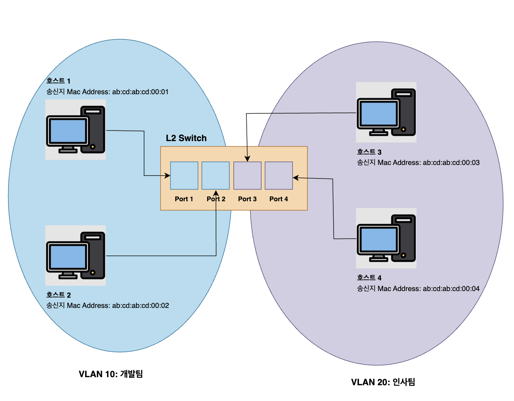
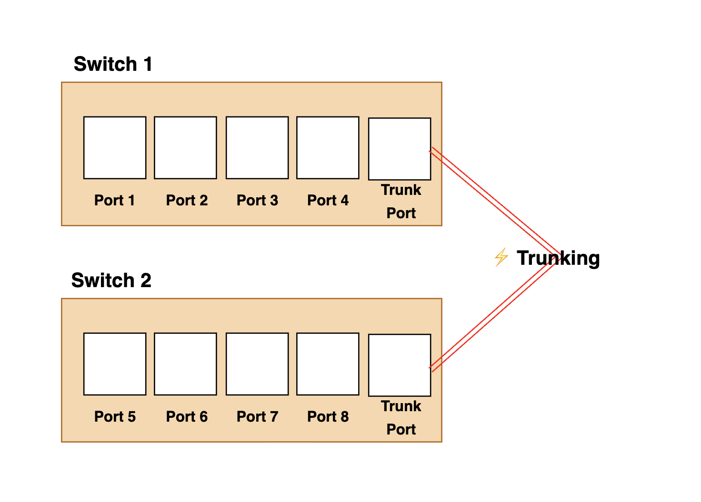

# 스위치

* 데이터 링크 계층의 네트워크 장비
* 포트에 여러 호스트를 연결할 수 있음
    * MAC 주소를 학습해 MAC 주소를 가진 호스트에만 프레임을 전송할 수 있음
* **반이중 모드의 통신**을 지원
* 포트별로 `콜리전 도메인(Collision Domain)`이 나뉨 
    * 때문에 충돌의 위험을 방지함

## 특징

### 1. MAC 주소 학습 (Mac Address Learning)
* 스위치는 프레임을 받으면 출발지 MAC 주소를 보고 그 MAC 주소가 어떤 포트에 있는지 학습함
### 2. MAC 주소 테이블 (Mac Address Table)
* 학습한 정보를 저장해 놓은 표
* 어떤 MAC 주소가 어느 포트에 있는지를 기록함
* 이 테이블을 기반으로 필요한 포트에만 프레임 전송

스위치는 아래 4가지 동작을 통해 프레임을 처리함

1. **플러딩(Flooding)**
    - 목적지 MAC 주소를 모를 때, 모든 포트로 프레임 전송
    - 브로드캐스트일 때도 사용됨

2. **포워딩(Forwarding)**
    - 목적지 MAC 주소가 테이블에 있을 경우, 해당 포트로만 전달

3. **필터링(Filtering)**
    - 출발지와 목적지가 같은 포트일 경우, 프레임을 버림 (전송 안 함)

4. **에이징(Aging)**
    - 일정 시간 동안 프레임을 못 받은 MAC 주소는 테이블에서 제거
    - 네트워크 변화에 유연하게 대응

  

## VLAN ((Virtual LAN))

* 하나의 스위치를 <U>논리적으로 여러 개의 네트워크로 나누는 기능</U>

### VLAN의 특징
1. 논리적 분리
    * 하나의 스위치(기기) 안에서 논리적인 단위로 네트워크를 분리할 수 있음
    * 슬랙: 채널
2. 기본적으로 VLAN 간 통신 불가
    * 개발팀(Port 1,2)과 인사팀(Port 3,4)은 서로 직접 통신 불가능
    * 통신하고 싶으면 라우터나 L3의 장비가 필요로 함
3. 보안 강화
    * 외부 접근 제한에 유리함
4. 트래픽 절감
    * 브로드캐스트는 해당 VLAN 내부에만 전달됨 
    * 불필요한 전송이 없어, 네트워크 효율 ↑

### VLAN의 종류

#### 1. 포트 기반 VLAN
* 
    * 스위치의 포트 번호를 기준으로 VLAN을 나누는 방식
    * 설정이 간편함
    * 물리적으로 포트를 변경하면 VLAN도 변경됨
    * 보안/유연함이 떨어짐

스위치 확장 방법

1. **트렁킹(Trunking)**
    - 
    - 여러 VLAN의 트래픽을 한 개의 링크를 통해 스위치 간에 전달하는 기술
    - 렁킹을 통해 한 케이블에 여러 `VLAN 태그`를 붙여 보내는 방식

2. **트렁크 포트 (Trunk Port)**
    - .png>)
    - **트렁킹이 설정된 포트**로, 여러 VLAN의 프레임을 구분해 전송하는 역할
    - `VLAN 태그(802.1Q Tag)`를 붙여서 전달
    - 보통 스위치 ↔ 스위치 간, 또는 스위치 ↔ 라우터 간 연결에 사용됨

##### 2. MAC 주소 기반 VALN
* 
    * PC의 MAC 주소를 기준으로 VALN을 나누는 방식
    * 어떤 포트에 꽂든지, MAC 주소만 같으면 VLAN은 그대로 유지됨
    * 이동성이 좋고 유연한 VLAN 구성 가능
    * 설정이 복잡하고 MAC 기반 VLAN을 지원하는 스위치를 써야 함

