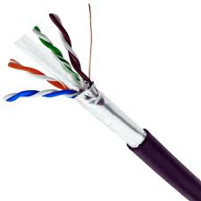

# 케이블 
* 전기 신호나 데이터를 한 지점에서 다른 지점으로 전달하기 위한 선(line)
* **정보가 지나가는 길**로 비유할 수 있음

  

## 1. 트위스티드 페어 케이블
* 구리 선으로 전기 신호를 주고 받는 통신 매체
* LAN 케이블 이라고 하면 누구나 떠오를 만큼의 대중적인 케이블

### 1.1. 구성요소

1. **케이블 본체**
    * 실제로 전기나 데이터를 전달하는 선 자체
    * 구조
        * `도체 (Core)` – 신호를 실제로 전달하는 금속선
        * `절연체 (Insulation)` – 도체를 감싸는 절연 고무
        * `차폐층` – 외부 간섭 차단
        * `외피 (Jacket)` – 전체 보호 껍질

2. 커넥터
    * 케이블 끝에 붙어서, 다른 장치랑 연결되게 해주는 부품
    * **주요 활용 커넥터**: RJ-45

### 1.2. 트위스티드 페어 케이블의 분류
* 트위스티드 페어 케이블은 외부 전자기파(노이즈)를 줄이기 위한 구조로 두 가닥의 도선을 서로 꼬아서 만든 케이블
* 쉴드(차페막)의 삽입을 통해 더 강한 간섭 차단, 즉 노이지를 줄이기가 가능함
* 이 쉴드에 따라 케이블의 분류가 달라짐

1. **STP (Shielded Twisted Pair)**
    * 
    * 각 트위스트된 <U>선쌍마다 독립적으로 금속 쉴드가 감싸져</U> 있음
    * 전자기 간섭(EMI)에 매우 강하며, 고주파 신호를 정확하게 전달하는 데 적합
    * 반드시 접지(Grounding)가 필요로 함 
    * 설계 과정이 복잡하며, 가격이 비쌈

2. **FTP (Foiled Twisted Pair)**
    * 
    * 전체 선(8가닥) 바깥을 <U>한 겹의 쉴드(알루미늄 호일 등)로만 감싼</U> 구조
    * STP보다는 간섭 차단 성능이 약하지만, UTP보다는 강함
    * 쌍별 쉴드는 없고 전체만 보호

3. **UTP (Unshielded Twisted Pair)**
    * 
    * 쉴드가 아예 없는 가장 기본형 케이블
    * 데이터 신호 보호는 트위스트 구조 자체에만 의존함
    * 가볍고 유연하며, 비용이 가장 저렴
    * 보통 일상 생활에서 보는 구조

* **쉴드 표기 약어**

| 약어 | 의미           | 설명                  |
|------|----------------|-----------------------|
| U    | Unshielded     | 쉴드 없음 (비차폐)     |
| F    | Foiled Shield  | 얇은 알루미늄 호일 쉴드 |
| S    | Braided Shield | 금속 직조망(브레이드) 쉴드 |

* **카테고리별 케이블 구조 분류 (Cat5e~Cat8)**
    * 카테고리(cat)이 높을 수 록 수송신할 데이터의 양이 많고 빠름을 의미

 카테고리 | 대역폭 (MHz) | 최대 속도           | 일반적 구조          | 사용 예시             |
|----------|--------------|---------------------|----------------------|----------------------|
| Cat5e    | 100          | 1 Gbps              | U/UTP                | 가정, 사무실 LAN      |
| Cat6     | 250          | 1~10 Gbps (최대 55m)| U/UTP, U/FTP         | 기업, 학교            |
| Cat6a    | 500          | 10 Gbps (100m)      | F/UTP, S/FTP         | 서버실, 고속망        |
| Cat7     | 600          | 10 Gbps (100m)      | S/FTP                | 고성능 네트워크       |
| Cat7a    | 1000         | 10 Gbps 이상        | S/FTP, SF/FTP        | 방송, 보안 환경       |
| Cat8     | 2000         | 25~40 Gbps (30m)    | S/FTP, SF/FTP        | 데이터센터, 백본 연결  |

  

## 2. 광섬유 케이블

* 빛(광신호)를 이용하여 정보를 주고 받는 케이블
* 전기신호를 사용하는 것보다 빠르고 장거리 전송까지 가능
* 대륙간의 송수신 가능

### 2.1. 구성요소
* 트위스티드 페어 케이블과 같이 커넥터와 케이블 본체가 있으며 역할 또한 같다
* 대표적인 커넥터의 종류는 다음과 같이 존재함

## 2.2. 구조

* **코어(Core)**
    * 광섬유에서 실질적으로 빛이 흐르는 곳
    * 이 코어의 지름에 따라 싱글 모드, 멀티 모드로 나누어짐
* **클래딩(Cladding)**
    * 빛이 코어 안에서 가두는 역할을 수행
    * 굴절률 차이로 인해 빛이 밖으로 새지 않도록 막아줌  

### 종류
1. **싱글 모드 광섬유 케이블**
    * 
    * **코어 지름이 매우 작음** (약 8~10μm)
    * **직진하는 레이저 광선 1가닥만** 통과 가능
    * 파정이 긴 장파장의 빛을 사용함 (L = Long)
        * 1000BASE-LX, 10GBASE-LR  
    * 장거리 전송에 적합 (수십~수백 km)
    * 주로 **통신사, 백본망**에 사용 (가격이 매우 비쌈)

2. **멀티 모드 광섬유 케이블**
    * 
    * **코어 지름이 큼** (약 50~62.5μm)
    * 여러 개의 빛 신호(모드)가 동시에 진행됨
    * 단파장 빛을 사용함 (S = Short)
        * 1000BASE-SX, 10BASE-SR
    * 전송 거리는 짧지만 설치가 간편하고 가격이 저렴함