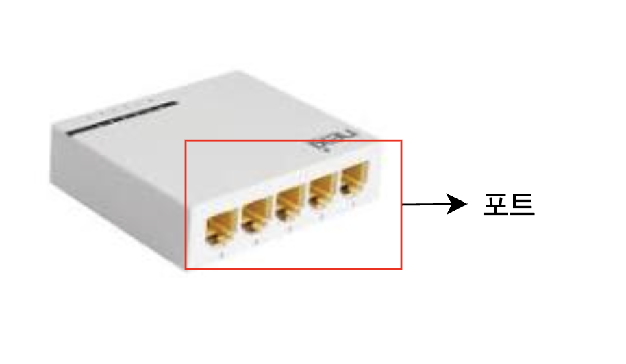

# 허브 (Hub)

* 여러개의 호스트를 연결하는 단순한 1계층 장비
* 커넥터를 연결할 수 있는 지점을 포트라고 함 
    * 이 포트를 통해 호스트와 통신 매체를 연결할 수 있음

## 특징
1. **데이터 처리**
    * 전달 받은 신호를 포트로 그대로 내보내기만 함
    * 허브를 통해 받은 신호를 데이터 링크 계층에서 패킷의 Mac주소를 확인하고 처리함 
2. **반이중 모드로 통신**
    * 한 번에 한쪽 방향으로만 통신 가능한 방식을 사용함
    * 동시에 송수신이 불가능 함

    

## 콜리전 도메인 (Collision Domain)

* `충돌(Collision)`이 발생할 수 있는 영역
    * `충돌(Collision)`?  
    → 여러 장치가 **동시에 데이터 신호를 전송**하여,  
      **전송 회선 상에서 신호가 겹치고 충돌**하는 현상

*  콜리전 도메인(Collision Domain)이란?  
  → **같은 물리적 전송 회선**을 공유하면서,  
     여러 장치가 동시에 데이터를 전송할 수 있는 **네트워크 구간**  
  → 이 구간에서는 **충돌이 발생할 가능성**이 존재함
* 즉 허브에 연결된 모든 장치 = 하나의 콜리전 도메인 아라 봐도 무방함

### 💥 충돌이 발생하는 시나리오
1. 허브는 받은 신호를 **모든 포트로 전기적으로 브로드캐스트**함
2. **모든 장치가 동일한 콜리전 도메인**에 연결됨 (하나의 회선 공유)
3. **동시에 여러 장치가 데이터를 전송**하면, 신호가 회선에서 **충돌(섞임)**
4. 허브는 제어 기능이 없어, **충돌을 감지하거나 방지할 수 없음**

  

# CSMA/CD
* Carrier Sense Multiple Access With Collision Detection의 약자
* 허브의 충돌 문제를 해결하기 위한 프로토콜
* 반이중 방식을 사용하는 이더넷의 대표 송수신 방법

## CS (Carrier Sense)
.png>)
* `캐리어 감지`를 의미
    * `캐러어 감지`?: 전송 전에 선로(회선)를 확인하는 과정
    * 네트워크에 누가 먼저 보내고 있는지 확인
        * 누가 전송 중이면 기다리고, 비어 있으면 전송 시작

## MA (Multiple Access)
.png>)
* 두 개 이상의 호스트가 하나의 네트워크에 동시에 네크워크를 사용할려고 할 때를 의미
* 다중 접속을 의미
* 하나의 회선을 여러 장치가 공유

## CD (Collision Detection)
.png>)
* 만약 두 장치가 동시에 전송하면 충돌이 발생
    1. 이때 충돌이 났다는 걸 신호 세기를 분석해서 감지함
    2. 충돌 발생 시, 전송을 멈추고 Jam Signal을 보내며, 랜덤 시간 대기 후 재전송 시도 (Backoff)
