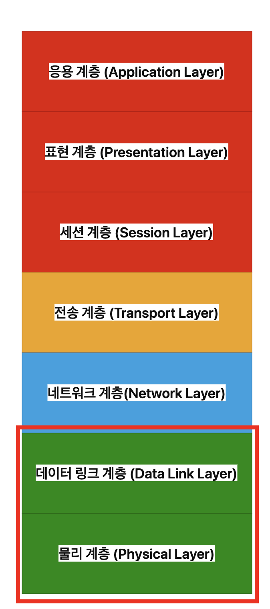
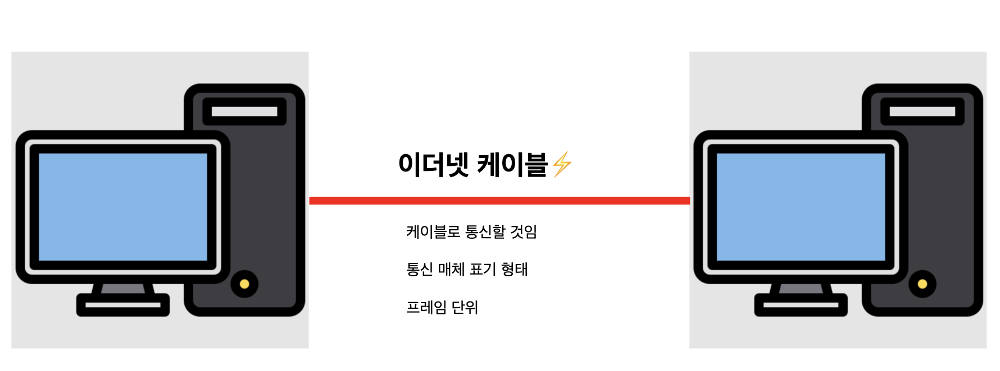
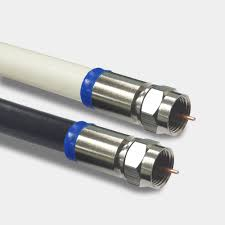
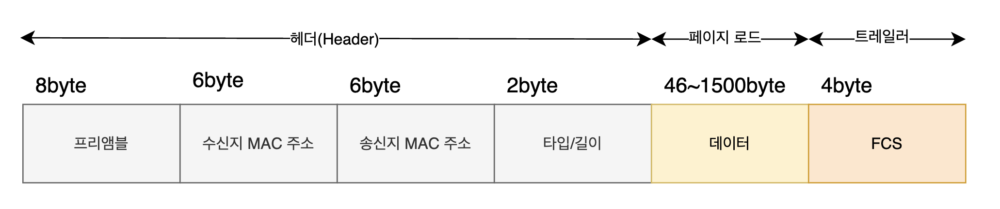

# 이더넷 (Ethernet)

* 현대 LAN 환경에서 대중적으로 사용하는 기술
* 다양한 통신 매체들의 규격들과 송수신 되는 프레임의 형태, 프레임을 주고 받는 방법들의 정의된 기술
* 이 기술은 `국제적으로 표준화`가 되어 있음 (이름: IEEE 802.3)
* 이 기술은 `OSI 7 Layer`의 데이터 링크, 물리 계층과 큰 연관이 있음

    * 물리 게층에서 `이더넷 케이블`이라는 것으로 전기신호를 주고 받음
    * 그 케이블이 사용하는 표기하는 방식이 있음
    * 컴퓨터 사이에 데이터를 통신할 때에 `프레임(Frame)`이리는 단위로 나누어 전송함

## 1. 통신 매체 종류 
* 데이터를 전송하는 데 사용되는 모든 물리적 경로 또는 환경

### 1.1. 물리적 통신 매체 
1. **동축 케이블 (특성 표기: C)**
* 
* `구조`: 가운데에 구리선, 그 주변에 절연체와 금속 차폐막이 감싸져 있음
* `신호 전송 방식`: 전기 신호 (고주파 전송)
* `속도/거리`: 중간 속도, 중거리 통신에 적합
* `사용 예시`: 케이블 TV, 구형 이더넷, CCTV
* **장점**: 외부 전자파에 강함 (쉴딩 구조)
* **단점**: 무겁고 설치의 어려움이 있음

2. **트위스티드 페이 케이블 (특성 표기: T)**
* 
* `구조`: 두 가닥의 구리선을 서로 꼬아서 만든 케이블
* `신호 전송 방식`: 전기 신호
* `속도/거리`: 빠르고, 근거리 통신에 적합
* `종류`
    * `UTP`: 차폐 없음 (일반적인 랜선)
    * `STP`: 차폐 있음 (전자파에 더 강함)
* `사용 예시`: 인터넷 랜선 (Cat5, Cat6 등)
* **장점**: 가볍고 설치 쉬움
* **단점**: 외부 간섭에 상대적으로 약함 (UTP 기준)

3. 단파장 광섬유 케이블 (특성 표기: S)
* 
* `신호 전송 방식`: 레이저 광 (1개의 경로)
* `속도/거리`: 매우 빠르고 장거리 전송에 적합 (수 km~수십 km)
* `코어 직경`: 매우 얇음 (810μm)
* `사용 예시`: 통신망 백본(Backbone), 국가간 통신

4. 장파장 광섬유 케이블 (특성 표기: L)
* 
* `신호 전송 방식`: LED 광 (여러 경로)
* `속도/거리`: 중거리 (최대 수백 m 정도), 단파장보다 느림
* `코어 직경`: 두껍다 (5062.5μm)
* `사용 예시`: 빌딩 내부, 기업 내부 통신

### 1.2. 무선 통신 매체 
* 블루투스
* wifi

  

## 2. 통신 매체 표기 형태
* 통신 매체의 속도와 특성등을 한눈에 파악하기 쉽게 표기한 형태
* **구조:** `[전송 속도]` - `[Base]` - `[추가 특성]`

### 2.1.  전송 속도
* 초당 몇 Mbps,Gbps 속도로 데이터를 전송할 수 있는지를 나타냄
    * `숫자만 표기 되었을 경우`: Mbps 속도
    * `숫자 뒤에 G가 붙어 있을 경우`: Gbps 속도

| 표기   | 의미                           |
|--------|--------------------------------|
| `10`   | 10Mbps 전송 속도              |
| `100`  | 100Mbps 전송 속도             |
| `1000` | 1Gbps (1000Mbps) 전송 속도    |
| `10G`  | 10Gbps 전송 속도              |

### 2.2. BASE
* Baseband의 약자로, 변조 타입을 의미
    * `변조 타입?`: bit(0,1)로 변환된 데이터를 통신 매체로 전송하는 방법

### 2.3. 추가 특성
* 통신 매체의 특성을 명시 함
    * `전송 가능한 최대 거리`
    * `물리 계층 인코딩 방식`
    * `레인 수`: 비트 신호를 옮길 수 있는 전송로의 갯수 

  

## 3. 이더넷 프레임
* 데이터 링크 계층에서 데이터를 실제 네트워크(무선, 케이블)를 통해 전달할 수 있게 구성한 형식
* 상위 계층으로부터 받아드린 정보와 헤더를 추가하는 과정인 캡슐화를 통해 만들어짐
* **구조**
    * | Preamble | SFD | Destination MAC | Source MAC | Type | Payload | FCS |

### 3.1.프리앰블
* 이더넷 프레임의 시작을 알리기 위한 7바이트(56비트) 크기의 <U>동기화 정보</U>
* 각 바이트는 10101010 이라는 패턴의 비트로 구성됨
* 이 패턴은 수신 측 장비가 클럭(타이밍)을 동기화할 수 있도록 도와줌
* 그 다음 오는 1바이트의 `SFD(Start Frame Delimiter)`는 10101011 비트 패턴으로, 프레임의 본격적인 시작을 알리는 신호
    * 즉, Preamble(7B) + SFD(1B) = 총 8바이트가 프레임 시작 구간

### 3.2. 수신/송신지 MAC 주소
* MAC(Media Access Control) 주소는 네트워크 인터페이스 카드(NIC) 에 할당된 물리적인 하드웨어 주소
* 각 주소는 6바이트(48비트) 길이이며, 16진수로 표현됨 (예: 00:1A:2B:3C:4D:5E)
* 이더넷 프레임에서
    * `Destination MAC (수신지 맥))`: 프레임을 받을 장치의 MAC 주소
    * `Source MAC(송신지 맥)`: 프레임을 보낸 장치의 MAC 주소
* MAC 주소는 일반적으로 제조사에서 고유하게 할당함

### 3.3. 타입/길이
* 해당 필드의 값은 두 가지 방식으로 해석 됨
1. **Type (이더 타입) : 상위 계층 프로토콜을 식별**
* 어떤 정보를 캡슐화 하였는지 나타내는 정보
* 필드가 1536 (0x0600) 이상이면 Type으로 해석

| 값  | 의미   |
|----------|--------|
| 0x0800   | IPv4   |
| 0x0806   | ARP    |
| 0x86DD   | IPv6   |

2. **Length (길이)**
* 필드가 1500 이하이면 길이로 해석
* 이 경우는 `데이터(payload)의 크기(Byte)` 를 나타냄

### 3.4. 데이터(payload)

* `데이터(payload)`는 상위 계층(보통 네트워크 계층)에서 전달된 `PDU (Protocol Data Unit)가 들어가는 영역`
* 예) 네트워크 계층의 IP 패킷 전체 = Payload
* 즉, 이더넷 프레임 내부의 Payload는 "IP 헤더 + IP 데이터" 같은 형태로 구성
* **최대 크기(Max): 1500 bytes**
    * → 이것은 이더넷의 **MTU (Maximum Transmission Unit)**라고 하며, IP 패킷 전체 크기가 1500 byte를 넘을 수 없음
    * → 그 이상이면 IP 단에서 `Fragmentation(조각화)` 발생함

* **최소 크기(Min): 46 bytes**
* → 이더넷 프레임의 전체 크기는 64 bytes 이상이어야 함 
* → MAC 헤더(14 byte) + 데이터(46 byte) + FCS(4 byte) = 최소 64 byte
    * 데이터가 46 byte보다 작으면, 이더넷 프레임의 최소 길이를 만족시키기 위해  <u>0으로 패딩(padding)</u>이 자동으로 추가됨.

### 3.5. FCS
* 이더넷 프레임이 전송 중 손상되었는지 확인하기 위한 오류 검출 필드
* `CRC (Cyclic Redundancy Check, 순환 중복 검사)` 결과가 들어감
    1. CRC는 송신 쪽에서 **프레임 전체(헤더 + 데이터)** 에 대해 수학적으로 계산한 **검사값(hash)** 임

    2. 수신 쪽도 동일한 방식으로 CRC를 다시 계산
    * FCS에 있는 값과 일치하는지 비교
    * 일치하지 않으면, 데이터가 전송 중 손상됨을 의미함.