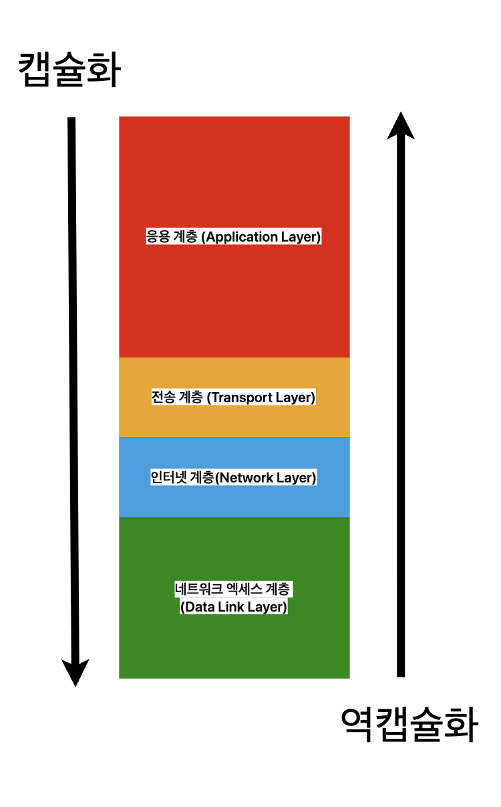

  

# 캡슐화
* 상위 계층에서 받은 데이터를 하위 계층에서 사용할 수 있는 형식으로 변환하는 과정
* 변환하는 과정은 `헤더`, `트레일러` 등의 정보를 <U>추가</U>하며 구성됨

## 캡슐화 과정
* http://example.com 로 접속 요청한다고 가정

### 1. Application Layer
* 브라우저에서 웹사이트(http://example.com)로 요청할 때 생성되는 실제 요청
    * 사용자가 브라우저 주소창에 URL을 입력하면, 브라우저는 HTTP 프로토콜을 사용하여 서버에 요청을 보냄
    * 이때 생성되는 데이터가 바로 <U>애플리케이션 계층 데이터(Payload)</U>
* **[Payload]**
    * GET / HTTP / 1.1
    * Host: example.ccm
    * User-Agent: chrome/111 

  

### 2. Transport Layer
* 통신 노드 간의 연결을 제어하고, 신뢰성 있는 데이터 전송을 담당
    * 애플리케이션 계층에서 받은 데이터를 목적지까지 안전하게 전달하기 위해 **TCP** 또는 **UDP**와 같은 프로토콜을 사용
    * TCP는 신뢰성 있는 연결(데이터 손실, 순서 보장 등)을 제공하며, UDP는 빠르지만 신뢰성은 보장하지 않음
* `Protocol Header`: UDP, TCP  
    * 이 계층에서는 데이터 앞에 **전송 계층 헤더**를 추가함

* **[Protocol Tcp] + [Payload]**
    - Source Port: 49523  
        * 데이터를 보내는 쪽(클라이언트)의 포트 번호
    - Destination Port: 80  
        * 데이터를 받는 쪽(서버, HTTP의 경우)의 포트 번호
    - Sequence Number: 10001  
        * 데이터의 순서를 맞추기 위한 번호
    - ACK Number: 0  
        * 상대방이 보낸 데이터에 대한 응답(확인) 번호
    - Flags: SYN/ACK..  
        * 연결 설정, 해제, 데이터 전송 상태 등을 나타내는 플래그 비트

  

### 3. Network Layer
* 어떤 IP로 데이터를 보낼지 관리
    * 데이터를 목적지까지 전달하기 위해 각 장치의 IP 주소를 사용함
* 통신 노드간의 IP패킷을 전송하는 기능 + 라우팅
    * 네트워크 계층에서는 데이터가 여러 네트워크를 거쳐 목적지까지 갈 수 있도록 경로(라우팅)를 결정함
* `Protocol Header`: IP, ARP, RARP  
    * 이 계층에서는 **IP 헤더**를 데이터 앞에 추가하여, 송신자와 수신자의 IP 주소 등 네트워크 전송에 필요한 정보를 포함시킴

* **[Header IP] + [Protocol TCP] + [Payload]**
    - Source IP: 192.168.0.10  
        * 데이터를 보내는 쪽(클라이언트)의 IP 주소
    - Destination IP: 93.184.216.34 (example.com)  
        * 데이터를 받는 쪽(서버)의 IP 주소
    - TTL: 64  
        * 데이터가 네트워크를 몇 번(몇 개의 라우터)을 거칠 수 있는지 제한하는 값 (무한 루프 방지)
    - Protocol: TCP  
        * 상위 계층에서 어떤 프로토콜(TCP/UDP 등)을 사용하는지 명시

  

4. Data Link Layer
* 실제 물리적인 장비(MAC 주소)들 사이에 전송하기 위해 Ethernet Frame으로 감쌈
    * 네트워크 계층에서 만들어진 IP 패킷을 실제 네트워크(랜선, 무선 등)로 전송할 수 있도록 프레임 단위로 변환
    * 이 과정에서 이더넷 헤더가 추가되어, 송신자와 수신자의 MAC 주소 등 물리 계층 전송에 필요한 정보가 포함됨

* **[Header Ethernet] + [Header IP] + [Protocol TCP] + [Payload]**  
    - Destination MAC: 00:1a:2b:3c:4d:5e  
        * 데이터를 받을 장치(서버)의 물리적 네트워크 주소
    - Source MAC: 00:1b:2c:3d:4e:5f  
        * 데이터를 보내는 장치(클라이언트)의 물리적 네트워크 주소
    - Type: IPv4  
        * 상위 계층에서 어떤 프로토콜(IP 등)을 사용하는지 명시

  

# 역캡슐화 
* 하위 계층에서 받은 데이터에서 해더와 트레이너 같은 정보를 `제거`하며 해당 계층에서 사용할 수 있는 식으로 변환하는 과정

## 역캡슐화 과정
* http://example.com 로 접속 요청 받는다고 가정

#### 4. Data Link Layer
* 수신 장치의 네트워크 인터페이스 카드(NIC)가 이더넷 프레임을 수신
* **[Header Ethernet] + [Header IP] + [Protocol TCP] + [Payload]**
    - 이더넷 헤더를 확인하여 목적지 MAC 주소가 자신의 것인지 확인
    - **[Header Ethernet]** 제거  
    - 남은 데이터: [Header IP] + [Protocol TCP] + [Payload]

### 3. Network Layer
* 데이터가 네트워크 계층으로 전달됨
* **[Header IP] + [Protocol TCP] + [Payload]**
    - IP 헤더를 확인하여 목적지 IP 주소가 자신의 것인지 확인
    - **[Header IP]** 제거  
    - 남은 데이터: [Protocol TCP] + [Payload]

### 2. Transport Layer
* 데이터가 전송 계층으로 전달됨
* **[Protocol TCP] + [Payload]**
    - TCP 헤더를 확인하여 목적지 포트 번호가 자신의 애플리케이션과 일치하는지 확인
    - **[Protocol TCP]** 제거  
    - 남은 데이터: [Payload]

### 1. Application Layer
* 최종적으로 순수한 애플리케이션 데이터(Payload)만 남음
* **[Payload]**
    - 예를 들어, 웹 브라우저라면 HTTP 응답 메시지를 처리
