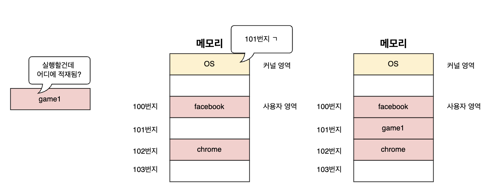

# 운영 체제 (Operating System)
* 컴퓨터의 HW와 SW의 `리소스(자원)을 관리`하고, `공통 서비스를 제공`하는 컴퓨터의 소프트웨어 시스템
    * `자원(resource)`?: 프로그램이 실행되기전 반드시 있어야하는 필수 요소를 말함
        * Ex: 컴퓨터의 4개의 필수 장치

  

## 운영체제의 핵심적인 기능

### 1. 메모리 관리

* 프로세스를 실행하기 위해선 자원이 필요한데, OS에선 프로세스들이 사용할 자원을 관리 해줌으로 프로세스에 필요한 자원을 알맞게 할당해줌

* **CPU**
    * CPU에선 하나의 프로세스만 실행할 수 있기 때문에 다른 프로세스는 기달려야 하는 상황이 나타남
    * 이러한 문제를 해결하기 위해 OS에선 어떤 프로세스를 먼저 처리할 것인지, 얼마나 사용할 것인지 결정 함
* **메모리**
    * 메모리에 저장될 프로세스들은 크기와 주소도 각각 다름
    * OS에선 새로운 프로세스가 적재 될 때마다 메모리의 어느 주소에 적재할지 결정함

### 2. 프로세스 관리

* 프로세스란? 컴퓨터에서 실행 중인 프로그램을 말함
* OS는 컴퓨터에서 실행 중인 프로그램을 관리할 수 있어야 함
    * 여러개의 프로세스를 동시에 실행할 수 있도록 관리
    * 다중 프로세스 실행시 각 프로세스가 충돌하지 않게 관리

### 3. 리소스 보호

* 운영체제는 여러 App들이 자원으로 접근할때 자원에 바로 app들이 접근하지 못하게 중계자 역할을 하게 됨

### 4. 파일 시스템 관리

* 파일을 열고, 삭제하고 생성하는 것도 OS에서 관리함

  

## 시스템 콜 (System call)
* 운영체제(OS)의 기능을 사용하기 위해 애플리케이션(프로그램)이 커널에게 요청하는 인터페이스
    * 응용 프로그램이 직접 자원에 접근할 수 없기에 운영체제에 간접적으로 요청하기 위한 인터페이스 

### 시스템 콜 과정

1. system call req
App processes가 특정 작업을 수행하기 위해 system call fnc을 호출

2. CPU의 trap 발생, 커널 모드 전환
system call fnc이 호출이 되면 CPU는 trap을 발생시켜 커널모드로 전환
system call 번호와 인자가 커널로 전달

3. 커널에서 system call 처리
커널에서 전달 받은 system call의 정보를 통해 적절한 karnel fnc 호출

4. 커널 함수 실행
호출한 karnel fnc을 실행

5. HW와 상호작용

6. 결과 값 반환, 사용자 모드로 복귀
작업이 완료되면 커널은 결과를 사용자 모드로 반환됨
CPU는 사용자 모드로 복귀됨
app Processes는 계속 실행

### 😁TMI: Java App의 System call
